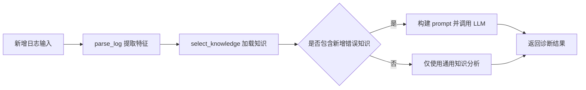

# 扩充日志示例与错误知识库设计文档

## 目标

在现有 QNN 日志分析技能的基础上，扩充日志示例集合和错误知识库，以支持更多典型错误场景的诊断和分析。

## 背景

当前系统已实现基于日志分析的 QNN 运行时错误诊断能力，包含：
- 现有示例：HTP 后端内存分配失败场景
- 现有知识库：QNN_STATUS_MEMORY_ALLOCATION_FAILED 错误条目

为提升系统对不同错误场景的覆盖能力，需要增加新的日志示例和对应的错误知识条目。

## 新增日志示例需求

### 示例场景选择原则

应选择满足以下条件之一的典型场景：
- QNN SDK 常见错误类型
- 不同后端（CPU/GPU/HTP）的代表性错误
- 不同故障阶段（设备初始化/图创建/推理执行）的典型问题
- 与现有示例形成互补的错误模式

### 新增日志示例结构

日志示例应遵循 QNN 运行时日志格式规范：

| 元素 | 说明 |
|------|------|
| 日志级别 | I (Info)、W (Warning)、E (Error) |
| 组件标识 | qnn-net-run、QNN_HTP、QNN_GPU、QNN_CPU 等 |
| 日志内容 | 描述操作或错误状态 |
| 错误代码 | QNN_STATUS_* 枚举值（若为错误日志）|

### 示例在 example.py 中的位置

新增日志示例应作为独立变量添加到 example.py 文件中，与现有示例并列，便于：
- 单独测试和验证
- 作为文档化的参考用例
- 支持未来批量测试场景

## 新增错误知识库条目需求

### 知识条目结构规范

每个错误知识条目应遵循 errors.md 中已建立的统一结构：

| 部分 | 内容要求 |
|------|----------|
| 错误标题 | QNN_STATUS_* 错误代码或特征性错误描述 |
| Typical Logs | 该错误在日志中的典型表现形式（关键字或日志片段）|
| Root Cause | 错误的根本原因分析（技术层面）|
| Solutions | 分步骤的解决方案列表 |

### 知识条目质量标准

- **准确性**：基于 Qualcomm QNN SDK 官方文档或可靠技术资料
- **完整性**：涵盖错误识别、原因分析、解决方案全流程
- **可操作性**：解决方案应具体、可执行，避免模糊描述
- **一致性**：术语、格式与现有知识库条目保持一致

### 知识条目在 errors.md 中的组织

新增知识条目应：
- 追加到 errors.md 文件末尾
- 保持与现有条目相同的 Markdown 格式层级
- 使用二级标题（##）标识错误类型
- 使用三级标题（###）标识各个部分

## 日志示例与知识库的对应关系

新增的日志示例和错误知识条目之间应满足：

| 关系要素 | 设计要求 |
|----------|----------|
| 可追溯性 | 日志示例中的错误代码或关键错误信息应能在知识库中找到对应条目 |
| 可验证性 | 使用新增日志示例运行 analyze_log_skill 时，应能通过知识库检索到相关错误信息 |
| 触发逻辑 | skill.py 中的 parse_log 和 select_knowledge 函数应能识别新增日志的特征，并加载相应知识 |

## 系统影响分析

### 对现有文件的影响

| 文件 | 影响类型 | 变更描述 |
|------|----------|----------|
| example.py | 扩展 | 新增日志示例变量及其调用代码 |
| knowledge/errors.md | 扩展 | 追加新的错误知识条目 |
| skill.py | 可能需要扩展 | 若新错误类型需要特定特征识别逻辑，可能需要更新 parse_log 或 select_knowledge 函数 |

### 对分析流程的影响

新增示例应能够无缝集成到现有分析流程中：

## 扩展性考虑

### 知识库扩展机制

设计应支持未来持续添加新的错误类型：
- 保持统一的知识条目结构模板
- 使用独立段落组织不同错误，便于检索和维护
- 避免硬编码错误类型，依赖关键字匹配机制

### 示例集管理策略

随着示例数量增长，应考虑：
- 在 example.py 中使用清晰的变量命名（如 log_memory_error、log_graph_error）
- 未来可考虑将示例集组织为结构化数据（如字典或独立的测试数据文件）
- 支持批量测试和回归验证

## 质量验证要点

完成扩充后，应验证以下方面：

1. **日志格式正确性**：新增日志符合 QNN 运行时日志格式规范
2. **知识库可检索性**：新增错误条目能够通过 select_knowledge 逻辑被正确加载
3. **分析有效性**：使用新增日志运行 analyze_log_skill 能够返回合理的诊断结果
4. **文档完整性**：知识条目包含 Typical Logs、Root Cause、Solutions 所有必需部分

## 实现优先级

建议按以下顺序实施：

1. 确定新增的错误场景类型（应与现有示例形成差异化覆盖）
2. 编写新的日志示例文本（遵循 QNN 日志格式）
3. 在 errors.md 中添加对应的错误知识条目
4. 将新日志示例添加到 example.py 中
5. 验证新示例能够被系统正确处理
6. 必要时更新 skill.py 中的特征提取逻辑
