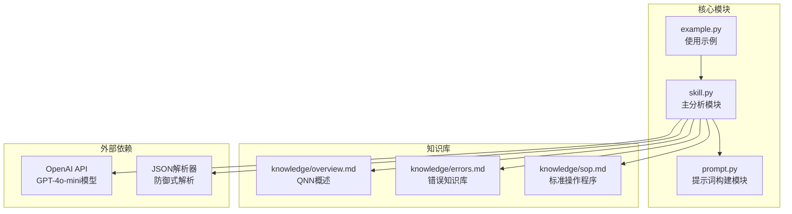
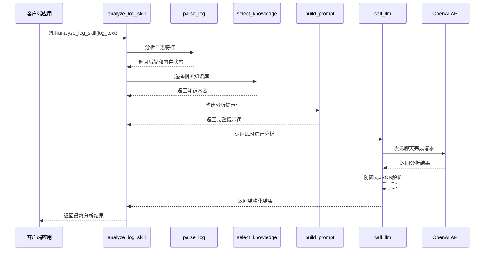
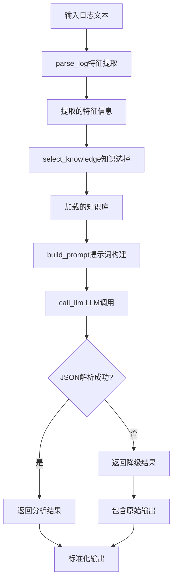
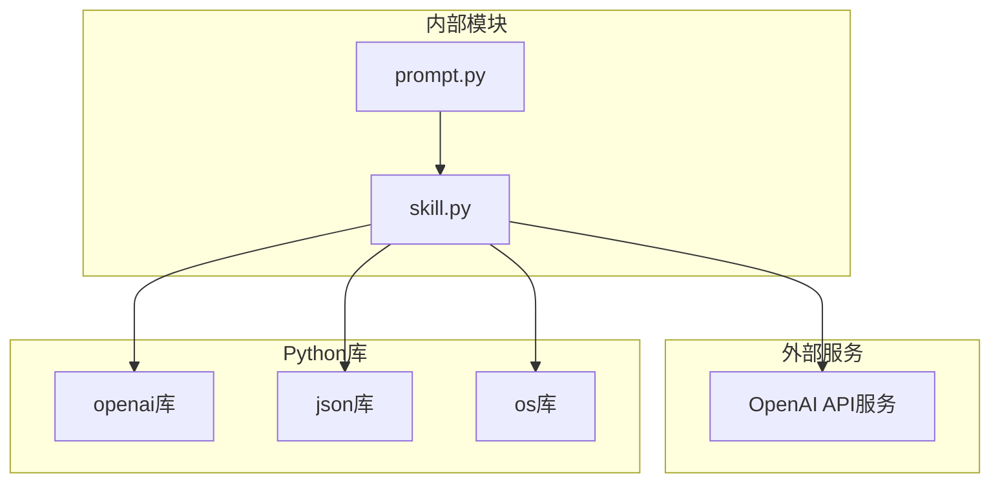
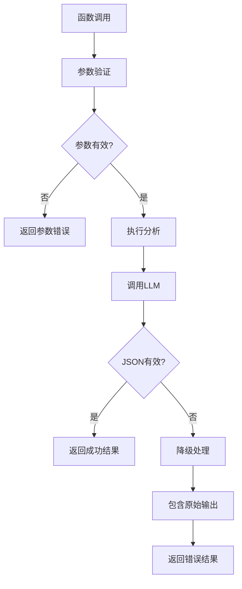

# API参考

<cite>
**本文档引用的文件**
- [skill.py](file://skill.py)
- [prompt.py](file://prompt.py)
- [example.py](file://example.py)
- [knowledge/overview.md](file://knowledge/overview.md)
- [knowledge/errors.md](file://knowledge/errors.md)
- [knowledge/sop.md](file://knowledge/sop.md)
</cite>

## 目录
1. [简介](#简介)
2. [项目结构](#项目结构)
3. [核心组件](#核心组件)
4. [架构概览](#架构概览)
5. [详细组件分析](#详细组件分析)
6. [依赖关系分析](#依赖关系分析)
7. [性能考虑](#性能考虑)
8. [故障排除指南](#故障排除指南)
9. [结论](#结论)

## 简介

本文档提供了analyze_log_skill函数的完整API参考文档。该函数是QNN SDK日志分析技能的核心组件，专门用于分析Qualcomm QNN SDK运行时日志并提供根本原因分析和解决方案建议。

analyze_log_skill函数接收字符串格式的QNN SDK日志文本作为输入，通过集成的LLM模型进行智能分析，并返回结构化的分析结果。该函数设计用于开发者集成和自动化工具解析，确保技术准确性和实用性。

## 项目结构

该项目采用模块化设计，主要包含以下核心组件：



**图表来源**
- [skill.py](file://skill.py#L1-L69)
- [prompt.py](file://prompt.py#L1-L29)
- [example.py](file://example.py#L1-L40)

**章节来源**
- [skill.py](file://skill.py#L1-L69)
- [prompt.py](file://prompt.py#L1-L29)
- [example.py](file://example.py#L1-L40)

## 核心组件

### 函数签名与基本要求

**函数定义**: `analyze_log_skill(log_text: str) -> dict`

**输入参数**:
- `log_text` (str): 必须为字符串格式的QNN SDK日志文本
- 建议包含完整的错误堆栈信息以提高分析准确性

**返回值**: 字典对象，包含以下键值对：
- `root_cause` (str): 字符串类型的根本原因描述
- `solutions` (list[str]): 字符串列表形式的解决方案建议
- `confidence` (float): 0.0-1.0范围内的置信度评分
- `raw_output` (str, 可选): 当LLM输出非有效JSON时的原始内容

**章节来源**
- [skill.py](file://skill.py#L63-L68)

## 架构概览

analyze_log_skill函数采用分层架构设计，通过多个处理步骤实现完整的日志分析流程：



**图表来源**
- [skill.py](file://skill.py#L63-L68)
- [prompt.py](file://prompt.py#L1-L29)

## 详细组件分析

### 主要函数实现

#### analyze_log_skill函数

这是系统的核心入口点，负责协调整个分析流程：

**功能特性**:
- 输入参数验证和预处理
- 智能知识库选择机制
- 提示词构建和LLM调用
- 结果后处理和错误恢复

**处理流程**:
1. 调用`parse_log()`提取日志特征
2. 使用`select_knowledge()`动态加载相关知识
3. 通过`build_prompt()`构建完整的分析提示
4. 调用`call_llm()`获取LLM分析结果
5. 返回标准化的结构化数据

**章节来源**
- [skill.py](file://skill.py#L63-L68)

#### parse_log函数

负责从日志文本中提取关键特征信息：

**识别逻辑**:
- 后端检测：通过检查"htp"关键字识别HTP后端
- 内存分配失败检测：识别特定的内存分配错误模式

**返回结构**:
```python
{
    "backend": "HTP" | "UNKNOWN",
    "memory_failed": bool
}
```

**章节来源**
- [skill.py](file://skill.py#L42-L47)

#### select_knowledge函数

智能知识库选择机制：

**默认加载**:
- `overview.md`: QNN SDK基础概述信息

**条件加载**:
- 当检测到内存分配失败时，自动加载`errors.md`
- 总是加载`sop.md`标准操作程序

**章节来源**
- [skill.py](file://skill.py#L49-L61)

#### call_llm函数

LLM调用和结果处理的核心组件：

**配置参数**:
- 模型: gpt-4o-mini (推荐，稳定、便宜、够用)
- 温度: 0.1 (日志分析需要低温度以获得确定性结果)
- 系统提示: 严格限制在提供的知识范围内

**防御式JSON解析**:
- 尝试解析LLM返回的JSON内容
- 失败时返回降级结构，包含原始输出
- 置信度设置为0.0表示不可信结果

**章节来源**
- [skill.py](file://skill.py#L18-L39)

### 数据流分析



**图表来源**
- [skill.py](file://skill.py#L42-L68)
- [prompt.py](file://prompt.py#L1-L29)

**章节来源**
- [skill.py](file://skill.py#L42-L68)
- [prompt.py](file://prompt.py#L1-L29)

## 依赖关系分析

### 外部依赖



**图表来源**
- [skill.py](file://skill.py#L1-L6)
- [prompt.py](file://prompt.py#L1-L29)

### 内部模块依赖

**直接依赖关系**:
- skill.py依赖prompt.py中的build_prompt函数
- 所有模块都依赖于知识库文件的存在
- example.py演示了正确的调用方式

**循环依赖**: 无循环依赖，模块间关系清晰

**章节来源**
- [skill.py](file://skill.py#L1-L6)
- [prompt.py](file://prompt.py#L1-L29)
- [example.py](file://example.py#L1-L40)

## 性能考虑

### 响应时间特征

**平均响应时间**: 通常在2-5秒范围内，具体取决于网络延迟和LLM处理时间

**性能优化策略**:
- 使用gpt-4o-mini模型平衡成本和性能
- 低温度设置(0.1)确保快速稳定的响应
- 防御式解析避免重复调用LLM

### 资源使用

**内存使用**: 相对较低，主要受限于日志文本大小和知识库内容

**并发处理**: 支持多线程调用，但建议控制并发数量以避免API限制

**缓存策略**: 当前实现未包含本地缓存，可考虑在应用层面实现

## 故障排除指南

### 常见问题及解决方案

**1. LLM返回无效JSON**
- 系统会自动降级处理，返回包含`raw_output`字段的结果
- `confidence`设置为0.0表示结果不可信
- 建议检查网络连接和API密钥有效性

**2. 知识库文件缺失**
- 确保knowledge目录下包含overview.md、errors.md、sop.md文件
- 文件权限问题可能导致读取失败

**3. API密钥问题**
- 检查OpenAI API密钥的有效性和余额
- 确认网络访问权限

**4. 日志格式不规范**
- 建议包含完整的错误堆栈信息
- 包含后端标识和错误代码有助于提高准确性

### 错误处理机制



**图表来源**
- [skill.py](file://skill.py#L18-L39)

**章节来源**
- [skill.py](file://skill.py#L18-L39)

## 结论

analyze_log_skill函数提供了一个完整、可靠的QNN SDK日志分析解决方案。其设计特点包括：

**技术优势**:
- 模块化架构便于维护和扩展
- 防御式编程确保系统稳定性
- 智能知识库选择提高分析准确性
- 标准化输出格式便于集成

**适用场景**:
- 开发者调试支持
- 自动化质量保证流程
- 运维故障诊断工具
- 技术支持工作流

**改进建议**:
- 添加本地缓存机制
- 实现更详细的错误分类
- 增加性能监控和日志记录
- 提供配置文件支持

该函数为QNN SDK用户提供了专业级的日志分析能力，能够显著提高问题诊断效率和准确性。