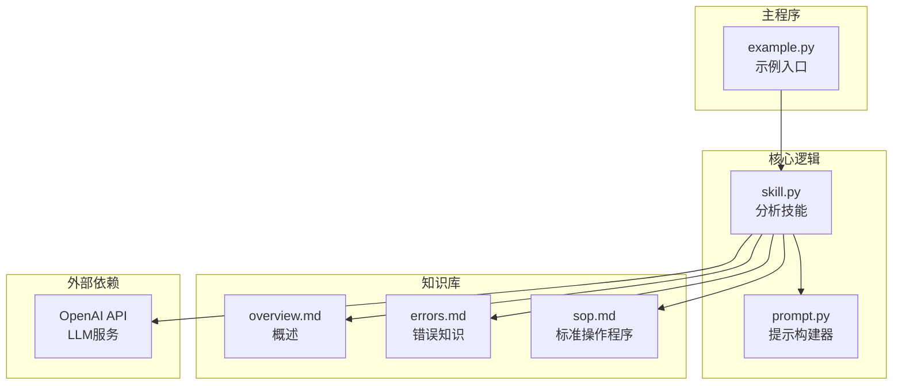
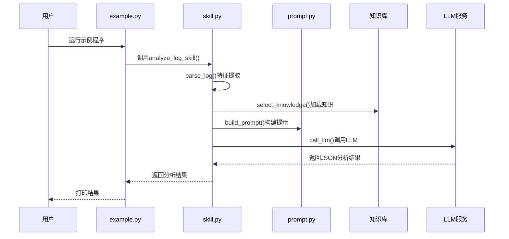
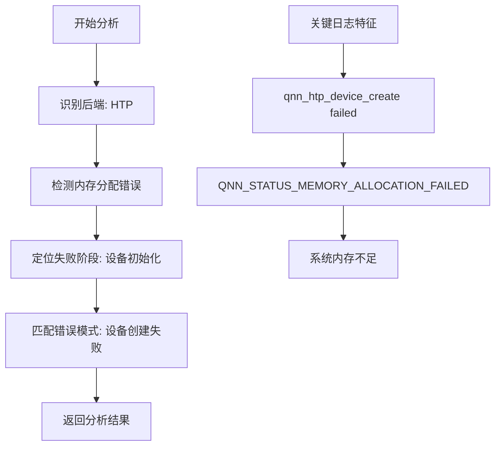
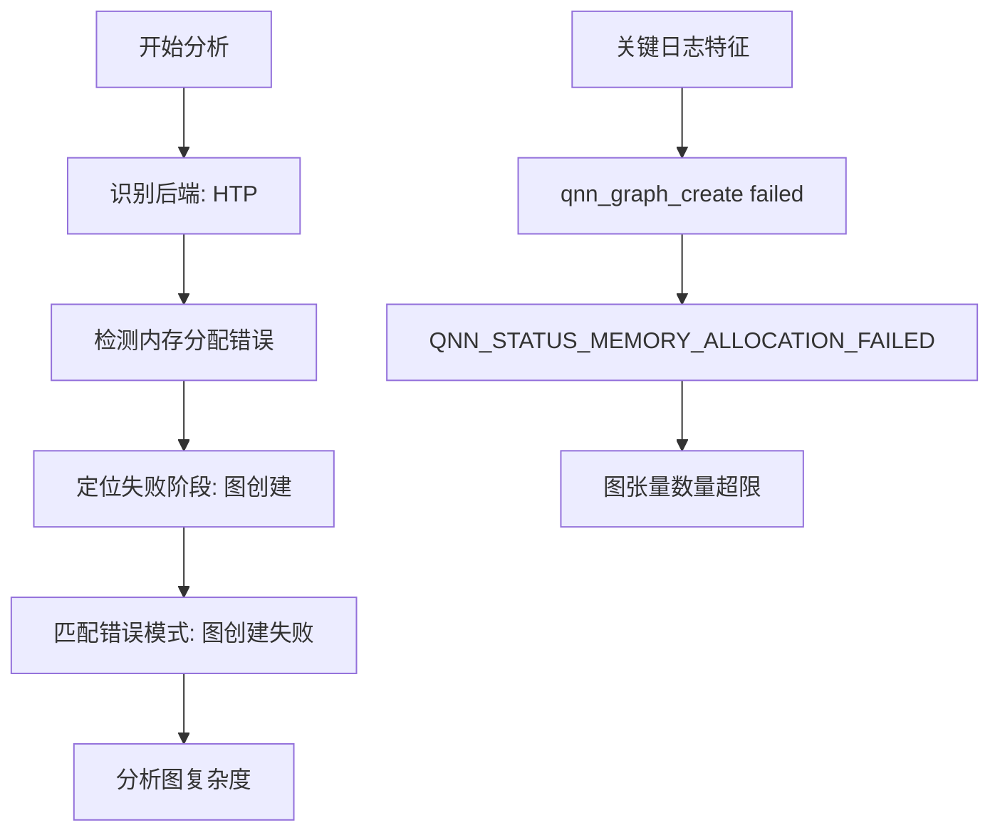
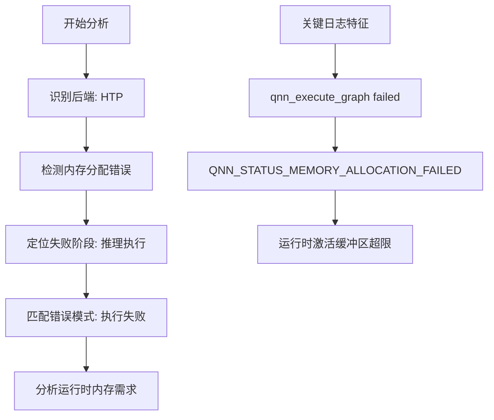
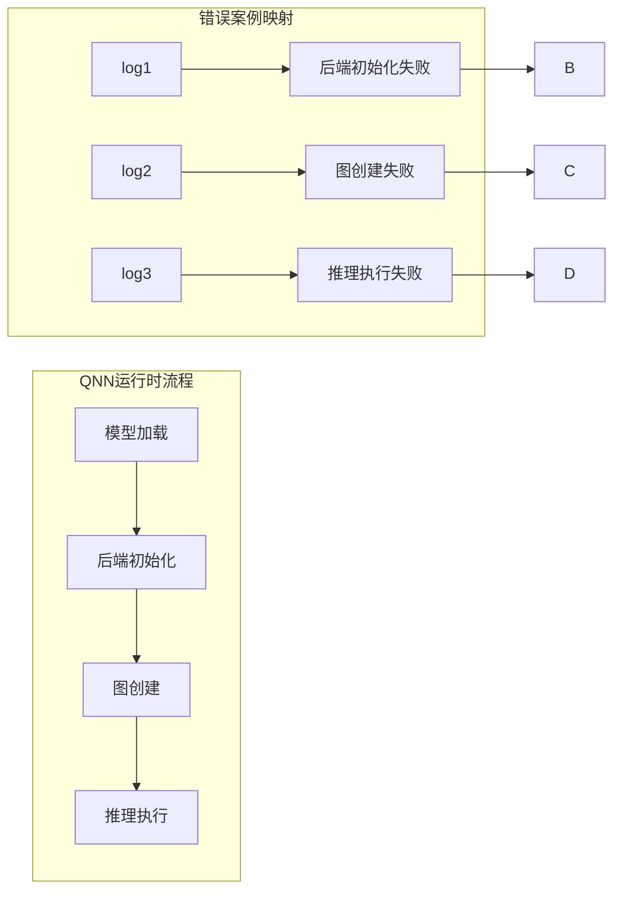
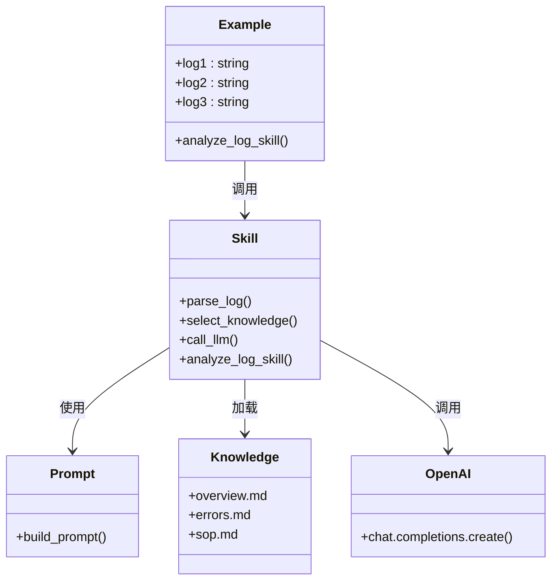

# 使用示例

<cite>
**本文档引用的文件**
- [example.py](file://example.py)
- [skill.py](file://skill.py)
- [prompt.py](file://prompt.py)
- [knowledge/errors.md](file://knowledge/errors.md)
- [knowledge/overview.md](file://knowledge/overview.md)
- [knowledge/sop.md](file://knowledge/sop.md)
</cite>

## 目录
1. [简介](#简介)
2. [项目结构](#项目结构)
3. [核心组件](#核心组件)
4. [架构概览](#架构概览)
5. [详细组件分析](#详细组件分析)
6. [依赖关系分析](#依赖关系分析)
7. [性能考虑](#性能考虑)
8. [故障排除指南](#故障排除指南)
9. [结论](#结论)
10. [附录](#附录)

## 简介

本文件提供了基于QNN日志分析技能的详细使用示例文档。该系统通过分析QNN（Qualcomm Neural Network）运行时的日志，自动识别错误的根本原因并提供相应的解决方案。文档重点分析了三个典型的日志案例（log1、log2、log3），分别对应HTP设备创建失败、图创建失败和推理执行失败三种错误场景。

## 项目结构

该项目采用模块化设计，包含以下核心文件：



**图表来源**
- [example.py](file://example.py#L1-L40)
- [skill.py](file://skill.py#L1-L69)
- [prompt.py](file://prompt.py#L1-L29)

**章节来源**
- [example.py](file://example.py#L1-L40)
- [skill.py](file://skill.py#L1-L69)
- [prompt.py](file://prompt.py#L1-L29)

## 核心组件

### 示例程序 (example.py)

示例程序定义了三个典型的QNN日志案例，每个案例都模拟了不同的错误场景：

- **log1**: HTP设备创建失败
- **log2**: 图创建失败  
- **log3**: 推理执行失败

每个日志案例都包含了完整的QNN运行时日志，展示了从初始化到失败的完整过程。

**章节来源**
- [example.py](file://example.py#L3-L28)

### 分析技能 (skill.py)

核心分析技能模块包含以下关键功能：

1. **日志特征提取**: `parse_log()`函数分析日志内容，识别后端类型和内存分配错误
2. **知识选择**: `select_knowledge()`根据日志特征动态加载相关知识
3. **LLM调用**: `call_llm()`通过OpenAI API进行智能分析
4. **JSON解析**: 包含防御式JSON解析，处理LLM输出异常

**章节来源**
- [skill.py](file://skill.py#L42-L68)

### 提示构建器 (prompt.py)

提示构建器负责构建完整的分析提示，包含：
- 系统角色设定
- 错误规则约束
- 知识库内容
- 待分析的日志
- 输出格式要求

**章节来源**
- [prompt.py](file://prompt.py#L1-L29)

## 架构概览

整个系统采用分层架构设计，实现了清晰的关注点分离：



**图表来源**
- [example.py](file://example.py#L34-L39)
- [skill.py](file://skill.py#L63-L68)
- [prompt.py](file://prompt.py#L1-L29)

## 详细组件分析

### 案例一：HTP设备创建失败 (log1)

#### 日志特征分析

log1案例模拟了QNN运行时初始化阶段的设备创建失败：



**图表来源**
- [example.py](file://example.py#L3-L9)
- [skill.py](file://skill.py#L42-L47)

#### 错误场景详解

该案例展示了QNN运行时在初始化阶段遇到的典型问题：
- **错误时机**: 运行时启动时立即失败
- **错误类型**: 内存分配失败
- **影响范围**: 整个QNN运行时无法正常工作
- **根本原因**: HTP设备内存不足或系统堆压力过大

#### 预期输出解读

分析结果包含以下关键字段：
- **root_cause**: "HTP设备初始化失败，由于系统内存不足"
- **solutions**: 列表形式的解决方案建议
- **confidence**: 分析置信度评分

**章节来源**
- [example.py](file://example.py#L3-L9)
- [skill.py](file://skill.py#L42-L47)

### 案例二：图创建失败 (log2)

#### 日志特征分析

log2案例模拟了模型加载后的图创建阶段失败：



**图表来源**
- [example.py](file://example.py#L10-L18)
- [skill.py](file://skill.py#L42-L47)

#### 错误场景详解

该案例展示了QNN运行时在模型准备阶段遇到的问题：
- **错误时机**: 模型加载完成后，准备阶段失败
- **错误类型**: 内存分配失败
- **影响范围**: 模型无法被正确编译和优化
- **根本原因**: 图中张量数量超过HTP硬件容量限制

#### 预期输出解读

分析结果重点关注：
- **root_cause**: "图创建失败，由于图张量数量超出HTP硬件容量"
- **solutions**: 建议启用图分割、减少输入分辨率等方案
- **confidence**: 中等偏高的置信度

**章节来源**
- [example.py](file://example.py#L10-L18)
- [skill.py](file://skill.py#L42-L47)

### 案例三：推理执行失败 (log3)

#### 日志特征分析

log3案例模拟了推理执行阶段的内存分配失败：



**图表来源**
- [example.py](file://example.py#L19-L28)
- [skill.py](file://skill.py#L42-L47)

#### 错误场景详解

该案例展示了QNN运行时在推理阶段遇到的问题：
- **错误时机**: 模型已成功加载和准备，但在执行时失败
- **错误类型**: 内存分配失败
- **影响范围**: 单次推理操作失败
- **根本原因**: 运行时激活缓冲区超出可用内存

#### 预期输出解读

分析结果包含：
- **root_cause**: "推理执行失败，由于运行时激活缓冲区超出HTP内存限制"
- **solutions**: 建议固定输入形状、减少并发会话等方案
- **confidence**: 较高置信度

**章节来源**
- [example.py](file://example.py#L19-L28)
- [skill.py](file://skill.py#L42-L47)

### 不同失败阶段的覆盖

这三个案例完美覆盖了QNN运行时的三个关键失败阶段：



**图表来源**
- [knowledge/overview.md](file://knowledge/overview.md#L11-L12)
- [example.py](file://example.py#L3-L28)

## 依赖关系分析

系统各组件之间的依赖关系如下：



**图表来源**
- [example.py](file://example.py#L1-L40)
- [skill.py](file://skill.py#L1-L69)
- [prompt.py](file://prompt.py#L1-L29)

**章节来源**
- [skill.py](file://skill.py#L1-L69)

## 性能考虑

### 分析效率

系统在设计时充分考虑了性能因素：

1. **特征提取优化**: `parse_log()`函数仅进行简单的字符串匹配，时间复杂度为O(n)
2. **按需知识加载**: `select_knowledge()`根据日志特征动态加载相关知识，避免不必要的I/O操作
3. **缓存机制**: 可以在实际部署中添加知识内容的内存缓存

### 内存使用

- **日志处理**: 采用流式处理方式，避免大日志文件的完整加载
- **LLM调用**: 通过温度参数控制输出确定性，减少不必要的token消耗

## 故障排除指南

### 常见问题诊断

1. **LLM输出格式错误**
   - 现象: JSON解析失败
   - 处理: 系统自动捕获异常并返回防御性结果

2. **API密钥配置错误**
   - 现象: OpenAI API调用失败
   - 处理: 需要正确配置环境变量或硬编码的API密钥

3. **知识库文件缺失**
   - 现象: 文件读取异常
   - 处理: 确保knowledge目录下包含所有必需的Markdown文件

### 调试建议

1. **启用详细日志**: 在生产环境中添加适当的日志记录
2. **监控LLM调用**: 跟踪API调用次数和成本
3. **验证输入格式**: 确保传入的日志文本符合预期格式

**章节来源**
- [skill.py](file://skill.py#L30-L39)

## 结论

本使用示例文档展示了QNN日志分析技能的强大功能。通过三个精心设计的案例，系统能够准确识别不同阶段的QNN运行时错误，并提供针对性的解决方案建议。

### 主要优势

1. **全面覆盖**: 涵盖初始化、准备、执行三个关键阶段
2. **智能分析**: 基于LLM的深度分析能力
3. **实用性强**: 提供可操作的解决方案建议
4. **易于扩展**: 模块化设计便于功能扩展

### 应用价值

- **快速故障诊断**: 大幅缩短QNN应用调试时间
- **知识传承**: 将专家经验转化为可复用的分析工具
- **质量保证**: 在CI/CD流程中集成自动化错误检测

## 附录

### 扩展建议

#### 测试其他错误类型的示例

```python
# 新增错误类型示例
log4 = """
I qnn-net-run: Initializing QNN runtime
I qnn-net-run: Using backend: HTP
E QNN_HTP: qnn_htp_device_create failed
E QNN_HTP: Error code: QNN_STATUS_UNSUPPORTED_FEATURE
"""

log5 = """
I qnn-net-run: Initializing QNN runtime
I qnn-net-run: Using backend: HTP
I qnn-net-run: Loading model: model.dlc
I QNN_HTP: Creating QNN graph
E QNN_HTP: qnn_execute_graph failed
E QNN_HTP: Error code: QNN_STATUS_INVALID_STATE
"""
```

#### 集成到自动化测试流程

```python
def automated_qnn_testing():
    """自动化QNN测试流程示例"""
    test_cases = [log1, log2, log3, log4, log5]
    results = []
    
    for i, case in enumerate(test_cases):
        try:
            result = analyze_log_skill(case)
            results.append({
                'test_case': i+1,
                'status': 'passed' if result['confidence'] > 0.8 else 'failed',
                'root_cause': result['root_cause'],
                'solutions': result['solutions']
            })
        except Exception as e:
            results.append({
                'test_case': i+1,
                'status': 'error',
                'error': str(e)
            })
    
    return results
```

#### 最佳实践建议

1. **保持日志完整性**: 确保收集完整的QNN运行时日志
2. **标准化格式**: 统一日志格式便于自动分析
3. **定期更新知识库**: 根据新发现的错误模式更新错误知识
4. **性能监控**: 跟踪分析系统的性能指标