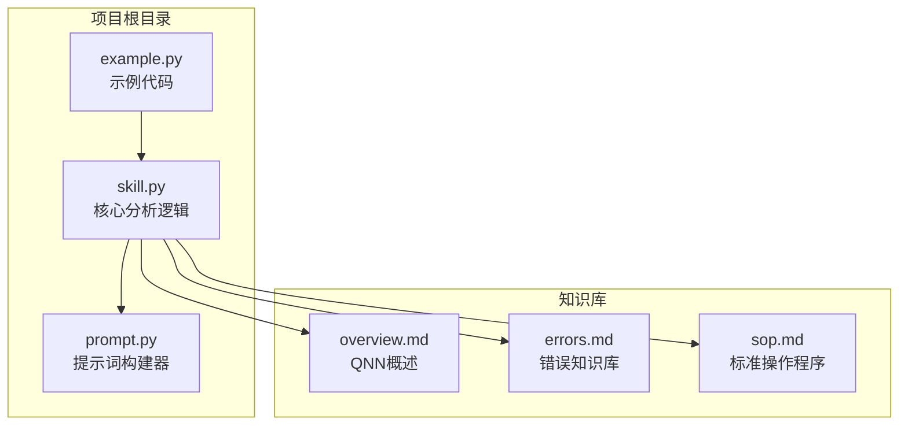
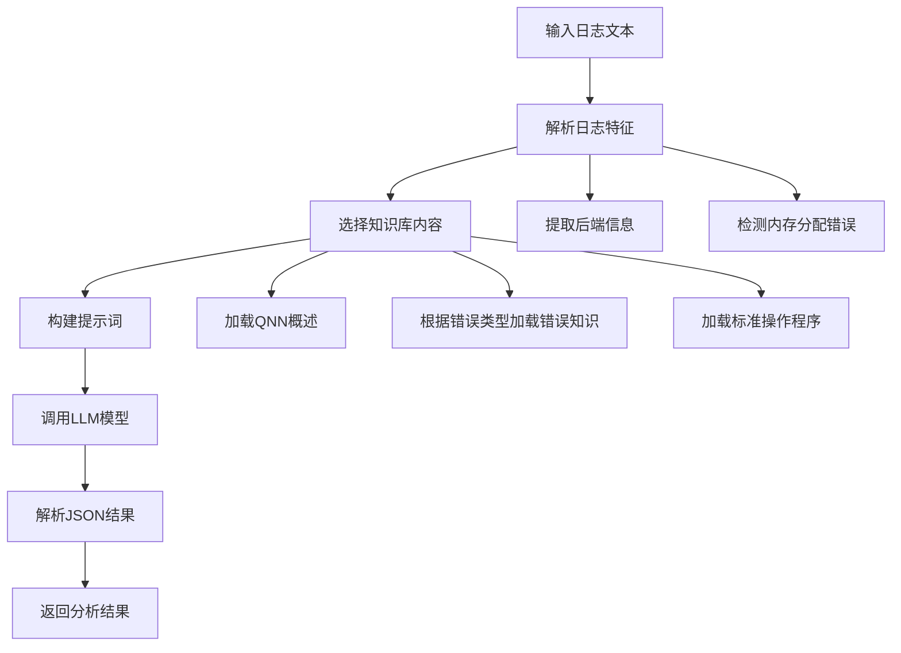
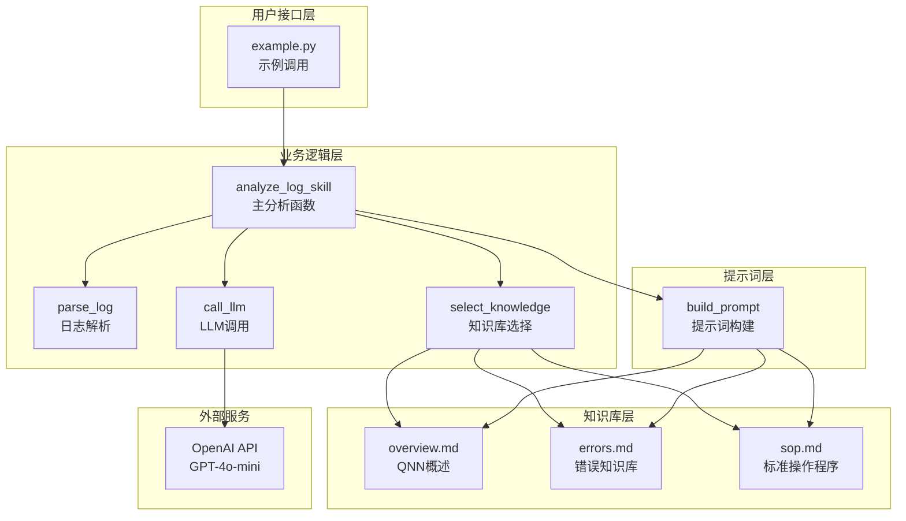
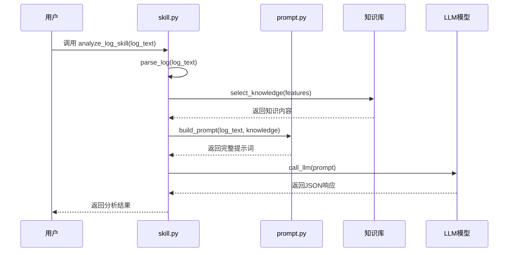
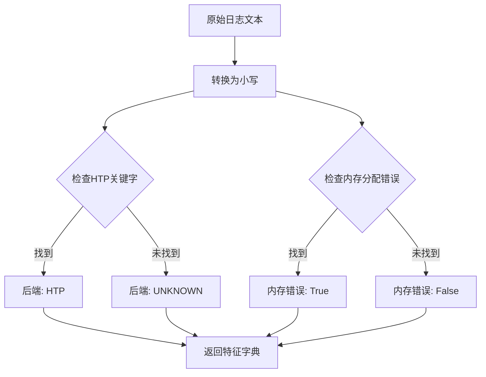
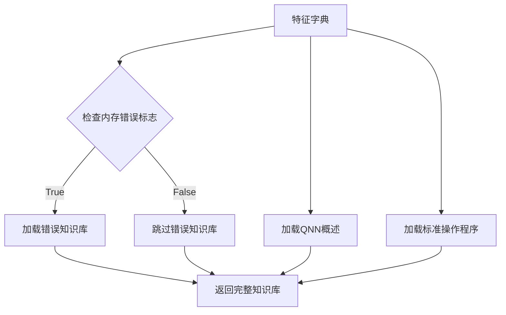
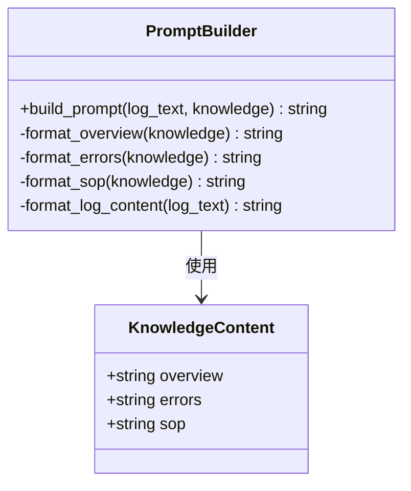
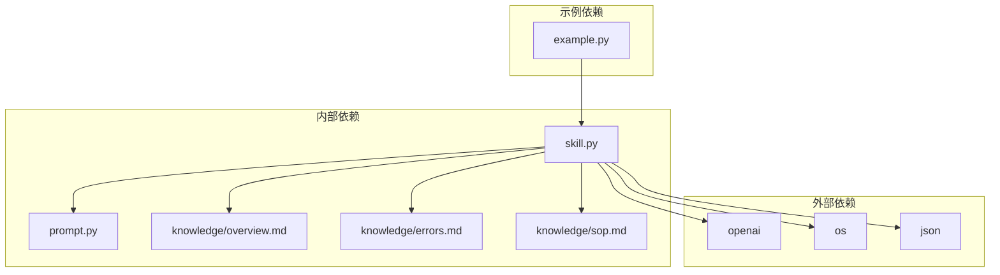

# 快速开始

<cite>
**本文档引用的文件**
- [example.py](file://example.py)
- [skill.py](file://skill.py)
- [prompt.py](file://prompt.py)
- [knowledge/overview.md](file://knowledge/overview.md)
- [knowledge/errors.md](file://knowledge/errors.md)
- [knowledge/sop.md](file://knowledge/sop.md)
</cite>

## 目录
1. [简介](#简介)
2. [项目结构](#项目结构)
3. [核心组件](#核心组件)
4. [架构概览](#架构概览)
5. [详细组件分析](#详细组件分析)
6. [依赖关系分析](#依赖关系分析)
7. [性能考虑](#性能考虑)
8. [故障排除指南](#故障排除指南)
9. [结论](#结论)

## 简介

本指南将帮助您在5分钟内完成QNN日志分析技能项目的部署和运行。该项目提供了一个智能的日志分析系统，能够自动识别Qualcomm QNN SDK运行时错误的根本原因并提供解决方案建议。

QNN（Qualcomm Neural Network）是用于在高通SoC上运行优化神经网络的SDK，支持CPU、GPU和HTP（Hexagon Tensor Processor）等不同后端。该系统通过分析QNN运行时日志，能够自动定位问题所在并提供针对性的解决方案。

## 项目结构

项目采用简洁的模块化设计，主要包含以下文件：



**图表来源**
- [example.py](file://example.py#L1-L40)
- [skill.py](file://skill.py#L1-L69)
- [prompt.py](file://prompt.py#L1-L29)

**章节来源**
- [example.py](file://example.py#L1-L40)
- [skill.py](file://skill.py#L1-L69)
- [prompt.py](file://prompt.py#L1-L29)

## 核心组件

### 分析函数 `analyze_log_skill`

这是项目的核心入口函数，负责整个日志分析流程：



**图表来源**
- [skill.py](file://skill.py#L42-L68)

### 示例数据集

项目提供了三个典型的QNN日志案例：

1. **设备创建失败** - HTP设备初始化阶段的内存分配错误
2. **图创建失败** - 图形创建阶段的内存分配错误  
3. **执行阶段失败** - 推理执行阶段的内存分配错误

每个案例都包含了完整的QNN运行时日志，展示了从初始化到失败的完整过程。

**章节来源**
- [example.py](file://example.py#L3-L28)
- [skill.py](file://skill.py#L63-L68)

## 架构概览

系统采用分层架构设计，各组件职责明确：



**图表来源**
- [skill.py](file://skill.py#L1-L69)
- [prompt.py](file://prompt.py#L1-L29)

## 详细组件分析

### 主分析函数 `analyze_log_skill`

这是整个系统的入口点，负责协调各个组件完成完整的分析流程：



**图表来源**
- [skill.py](file://skill.py#L63-L68)
- [prompt.py](file://prompt.py#L1-L29)

### 日志解析组件 `parse_log`

负责从原始日志中提取关键特征信息：



**图表来源**
- [skill.py](file://skill.py#L42-L47)

### 知识库选择逻辑 `select_knowledge`

根据日志特征动态选择相关知识内容：



**图表来源**
- [skill.py](file://skill.py#L49-L61)

**章节来源**
- [skill.py](file://skill.py#L42-L68)
- [prompt.py](file://prompt.py#L1-L29)

### 提示词构建器 `build_prompt`

将日志和知识库内容组织成结构化的提示词：



**图表来源**
- [prompt.py](file://prompt.py#L1-L29)

**章节来源**
- [prompt.py](file://prompt.py#L1-L29)

## 依赖关系分析

系统依赖关系清晰，主要依赖包括：



**图表来源**
- [skill.py](file://skill.py#L1-L6)
- [example.py](file://example.py#L1)

**章节来源**
- [skill.py](file://skill.py#L1-L6)
- [example.py](file://example.py#L1)

## 性能考虑

1. **API调用成本控制**：系统使用GPT-4o-mini模型，相比其他模型更经济实用
2. **温度参数设置**：设置为0.1以获得更稳定的分析结果
3. **防御性JSON解析**：防止LLM输出格式异常导致的解析失败
4. **缓存策略**：知识库内容在每次调用时重新加载，确保最新信息

## 故障排除指南

### 常见问题及解决方案

#### 1. 模块导入错误

**问题症状**：
```
ModuleNotFoundError: No module named 'skill'
```

**解决方法**：
- 确保在正确的项目根目录下运行
- 检查Python路径配置
- 确认所有必需的包已安装

#### 2. API密钥配置问题

**问题症状**：
```
AuthenticationError: Incorrect API key provided
```

**解决方法**：
- 替换示例中的默认API密钥
- 在环境变量中设置正确的API密钥
- 验证API密钥的有效性和权限

#### 3. 网络连接问题

**问题症状**：
```
ConnectionError: Unable to connect to OpenAI API
```

**解决方法**：
- 检查网络连接状态
- 验证防火墙设置
- 尝试使用代理服务器

#### 4. JSON解析错误

**问题症状**：
```
JSONDecodeError: Expecting value
```

**解决方法**：
- 检查LLM响应格式
- 调整temperature参数
- 验证提示词构建逻辑

**章节来源**
- [skill.py](file://skill.py#L18-L39)

## 结论

本快速开始指南涵盖了QNN日志分析技能项目的核心功能和使用方法。通过5分钟的部署时间，您就可以：

1. **成功运行示例代码**：使用提供的三个典型日志案例验证系统功能
2. **理解分析流程**：掌握从日志输入到结果输出的完整流程
3. **集成到现有项目**：了解如何在自己的应用中集成此分析能力
4. **故障排除**：具备解决常见问题的能力

该系统为Python初学者提供了友好的接口，同时为有经验的开发者提供了灵活的扩展空间。通过合理利用知识库内容和LLM能力，能够有效提升QNN日志分析的效率和准确性。