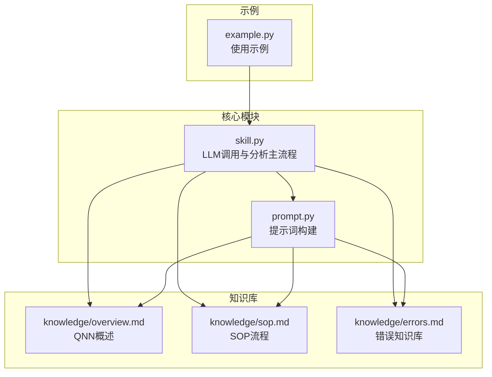
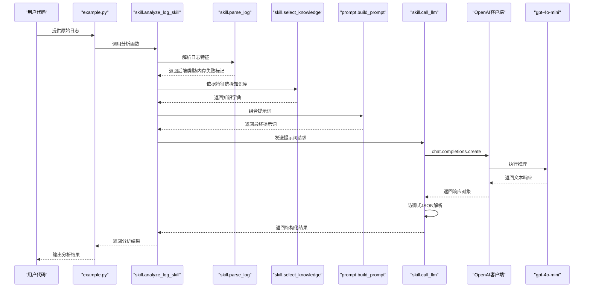
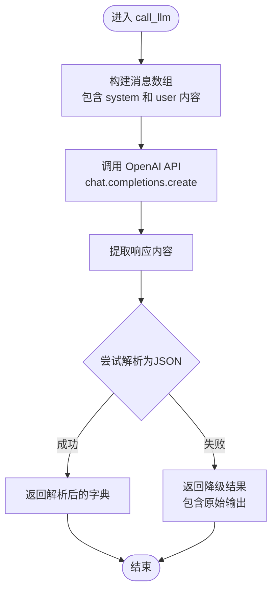
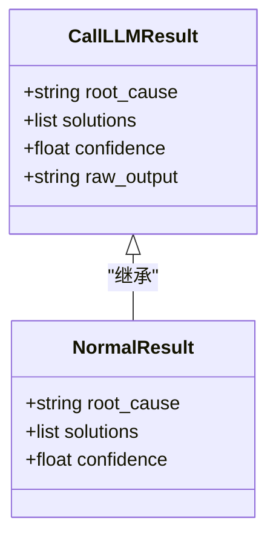
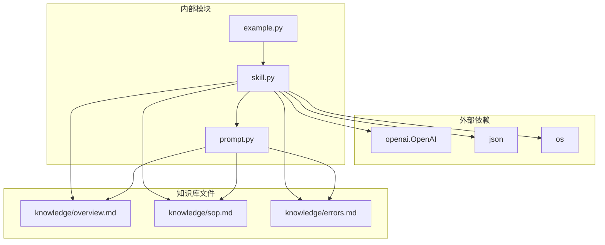

# LLM调用

<cite>
**本文档引用的文件**
- [skill.py](file://skill.py)
- [prompt.py](file://prompt.py)
- [example.py](file://example.py)
- [knowledge/overview.md](file://knowledge/overview.md)
- [knowledge/sop.md](file://knowledge/sop.md)
- [knowledge/errors.md](file://knowledge/errors.md)
</cite>

## 目录
1. [简介](#简介)
2. [项目结构](#项目结构)
3. [核心组件](#核心组件)
4. [架构总览](#架构总览)
5. [详细组件分析](#详细组件分析)
6. [依赖关系分析](#依赖关系分析)
7. [性能考量](#性能考量)
8. [故障排查指南](#故障排查指南)
9. [结论](#结论)
10. [附录：替换LLM后端集成指南](#附录替换llm后端集成指南)

## 简介
本项目实现了一个针对 Qualcomm QNN SDK 运行时日志的智能分析技能，通过调用 OpenAI 的 gpt-4o-mini 模型进行推理分析。该模块的核心是 call_llm 函数，它负责：
- 构建面向 QNN 专家的系统提示词
- 调用 OpenAI 客户端执行聊天补全
- 实施防御式 JSON 解析以确保输出稳定性
- 返回标准化的根因、解决方案和置信度结果

## 项目结构
该项目采用简洁的功能模块化设计，主要包含以下文件：
- skill.py：核心 LLM 调用逻辑与知识检索
- prompt.py：提示词构建工具
- example.py：示例用法演示
- knowledge/overview.md：QNN 基础概述
- knowledge/sop.md：标准作业流程
- knowledge/errors.md：常见错误知识库



**图表来源**
- [skill.py](file://skill.py#L1-L69)
- [prompt.py](file://prompt.py#L1-L29)
- [example.py](file://example.py#L1-L40)

**章节来源**
- [skill.py](file://skill.py#L1-L69)
- [prompt.py](file://prompt.py#L1-L29)
- [example.py](file://example.py#L1-L40)

## 核心组件
本模块围绕以下核心组件展开：

- OpenAI 客户端实例：封装了 API 密钥和基础配置
- SYSTEM_PROMPT：限定模型行为的系统提示词
- call_llm 函数：完整的 LLM 调用与输出解析流程
- 知识选择器：根据日志特征动态选择知识库内容
- 提示词构建器：将知识库与日志组合成最终提示词

**章节来源**
- [skill.py](file://skill.py#L1-L69)
- [prompt.py](file://prompt.py#L1-L29)

## 架构总览
下图展示了从日志输入到最终分析结果的完整数据流：



**图表来源**
- [example.py](file://example.py#L34-L39)
- [skill.py](file://skill.py#L63-L68)
- [prompt.py](file://prompt.py#L1-L29)

## 详细组件分析

### call_llm 函数实现详解
call_llm 是整个模块的核心，负责与 OpenAI API 的交互以及输出解析。

#### 关键实现要点
- **模型选择**：使用 gpt-4o-mini，平衡成本与性能
- **系统提示词**：严格限制模型行为，避免幻觉输出
- **温度参数**：设置为 0.1，确保输出稳定性和确定性
- **防御式 JSON 解析**：捕获解析异常并提供降级返回



**图表来源**
- [skill.py](file://skill.py#L18-L39)

#### 温度参数设置分析
温度=0.1 的设置原因：
- **稳定性要求**：日志分析需要一致的输出格式
- **确定性需求**：相同的输入应产生相同的 JSON 结构
- **生产环境适用**：避免模型在推理时引入随机性

**章节来源**
- [skill.py](file://skill.py#L18-L39)

### SYSTEM_PROMPT 设计与作用
SYSTEM_PROMPT 的设计目标：
- **领域专一性**：限定为 Qualcomm QNN SDK 专家角色
- **规则约束**：禁止幻觉 API 或参数，仅基于知识库分析
- **输出规范**：强制 JSON 格式输出，无额外文本
- **分析焦点**：专注于后端、错误码和失败阶段

该提示词确保模型在面对复杂的 QNN 日志时保持专业性和准确性。

**章节来源**
- [skill.py](file://skill.py#L8-L16)

### 防御式 JSON 解析机制
该机制是系统鲁棒性的关键保障：

#### 解析流程
1. **正常路径**：直接解析 LLM 返回的 JSON 字符串
2. **异常捕获**：捕获 JSONDecodeError 异常
3. **降级策略**：返回包含原始输出的结构化结果
4. **完整性保证**：即使解析失败也提供可用信息

#### 降级返回字段
- root_cause：指示输出不是有效 JSON
- solutions：空列表（无建议）
- confidence：0.0（无置信度）
- raw_output：原始 LLM 输出（便于调试）



**图表来源**
- [skill.py](file://skill.py#L30-L39)

**章节来源**
- [skill.py](file://skill.py#L30-L39)

### 知识库集成与动态选择
系统通过 select_knowledge 函数实现知识库的动态选择：

#### 选择逻辑
- **基础知识**：始终加载 overview.md
- **错误知识**：当检测到内存分配失败时加载 errors.md
- **操作流程**：始终加载 sop.md
- **上下文构建**：将知识内容注入到最终提示词中

#### 特征提取
parse_log 函数负责从日志中提取关键特征：
- 后端类型：识别 HTP 或 UNKNOWN
- 内存失败：检测特定错误模式

**章节来源**
- [skill.py](file://skill.py#L42-L61)

### 提示词构建与模板设计
build_prompt 函数将多个知识源整合为最终提示词：

#### 模板结构
- **角色设定**：QNN SDK 专家身份
- **规则声明**：仅使用提供的知识，不编造信息
- **知识分区**：OVERVIEW、ERROR KNOWLEDGE、SOP
- **日志输入**：实际待分析的日志内容
- **输出约束**：明确的 JSON 结构要求

**章节来源**
- [prompt.py](file://prompt.py#L1-L29)

## 依赖关系分析



**图表来源**
- [skill.py](file://skill.py#L1-L6)
- [prompt.py](file://prompt.py#L1-L29)
- [example.py](file://example.py#L1-L40)

**章节来源**
- [skill.py](file://skill.py#L1-L6)
- [prompt.py](file://prompt.py#L1-L29)
- [example.py](file://example.py#L1-L40)

## 性能考量
基于当前实现的性能特点：

### 模型选择优势
- **gpt-4o-mini**：相比 gpt-4o 具有更低的成本和延迟
- **适配场景**：日志分析任务不需要最高精度，稳定性更重要
- **响应时间**：通常在秒级范围内

### 优化建议
- **批量处理**：可考虑将多个日志合并处理以提高吞吐量
- **缓存策略**：对相同日志的重复分析结果进行缓存
- **并发控制**：限制同时的 API 调用数量以避免限流

## 故障排查指南

### 常见问题与解决方案

#### API 密钥相关问题
- **问题**：认证失败或权限不足
- **检查点**：确认 API 密钥格式正确且具有相应权限
- **解决**：更新密钥或检查网络代理设置

#### 输出解析失败
- **症状**：返回包含原始输出的降级结果
- **原因**：LLM 输出不符合 JSON 格式
- **处理**：检查 SYSTEM_PROMPT 是否被修改，或调整温度参数

#### 知识库加载失败
- **症状**：知识内容为空
- **原因**：文件路径错误或权限问题
- **解决**：验证文件存在性和访问权限

#### 网络连接问题
- **症状**：API 调用超时
- **原因**：网络不稳定或防火墙阻断
- **解决**：检查网络连接，配置代理设置

**章节来源**
- [skill.py](file://skill.py#L30-L39)

## 结论
本 LLM 调用模块通过精心设计的系统提示词、稳定的温度参数设置和完善的防御式解析机制，实现了对 QNN 日志的专业化分析能力。其模块化的架构便于维护和扩展，为后续集成其他 LLM 后端提供了清晰的接口。

## 附录：替换LLM后端集成指南

### 接口抽象设计
为支持不同 LLM 后端，建议定义统一的接口：

```python
class LLMInterface:
    def call(self, messages: list, temperature: float = 0.1) -> dict:
        """调用LLM并返回结构化结果"""
        pass
    
    def validate_response(self, content: str) -> dict:
        """验证并解析响应内容"""
        pass
```

### OpenAI 后端实现
当前的 OpenAI 实现作为参考实现，包含以下关键要素：
- 使用 chat.completions API
- 固定的 system/user 消息格式
- 防御式 JSON 解析
- 标准化的降级返回

### 新后端集成步骤
1. **实现接口**：创建新的 LLM 后端类并实现接口方法
2. **配置管理**：添加后端特定的配置参数
3. **测试验证**：确保输出格式与现有解析逻辑兼容
4. **性能对比**：评估新后端的成本和性能表现
5. **部署切换**：通过配置文件切换后端实现

### 配置文件示例
```yaml
llm_backend: "openai"  # 可选值: openai, anthropic, local
openai:
  api_key: "your-api-key"
  model: "gpt-4o-mini"
  temperature: 0.1
anthropic:
  api_key: "your-api-key"
  model: "claude-3-haiku"
  temperature: 0.1
```

### 最佳实践
- **保持接口一致性**：确保所有后端返回相同的结构化结果
- **异常处理统一**：实现统一的异常捕获和降级策略
- **性能监控**：为每个后端建立性能指标和成本跟踪
- **A/B 测试**：允许在不同后端之间进行对比测试