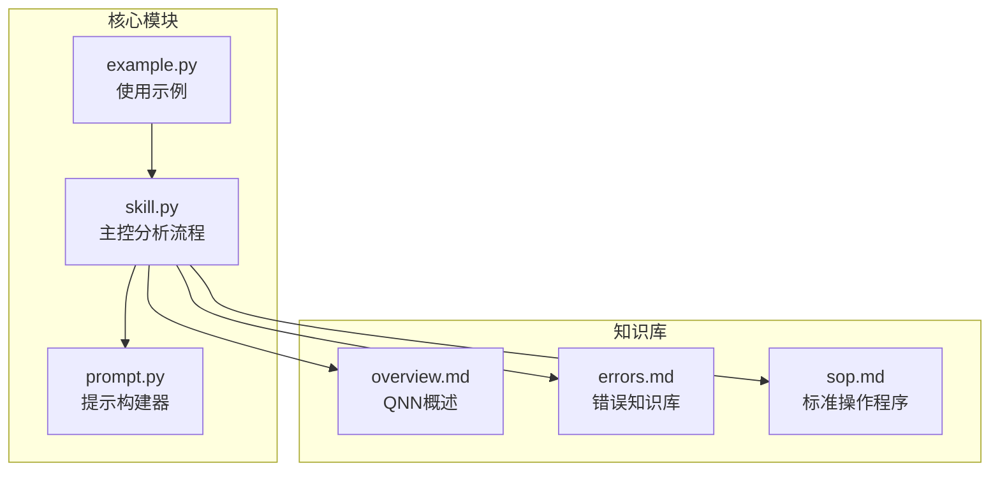
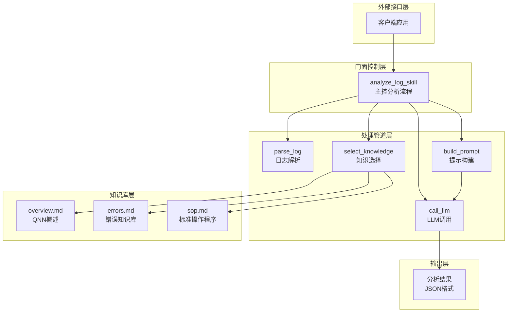
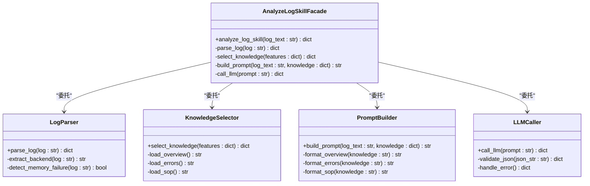
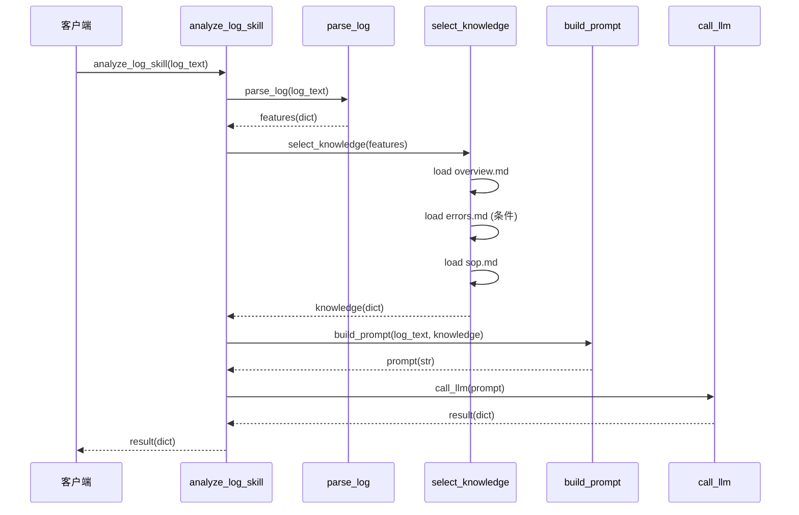
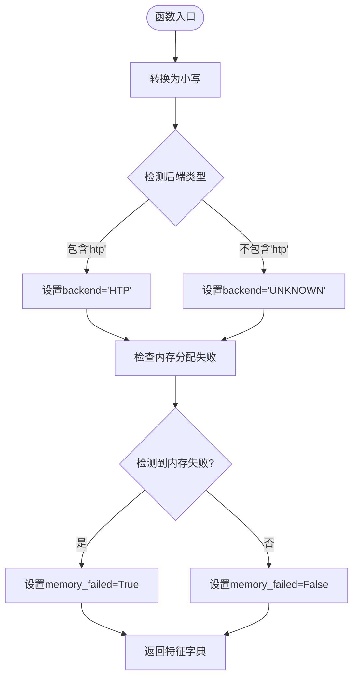
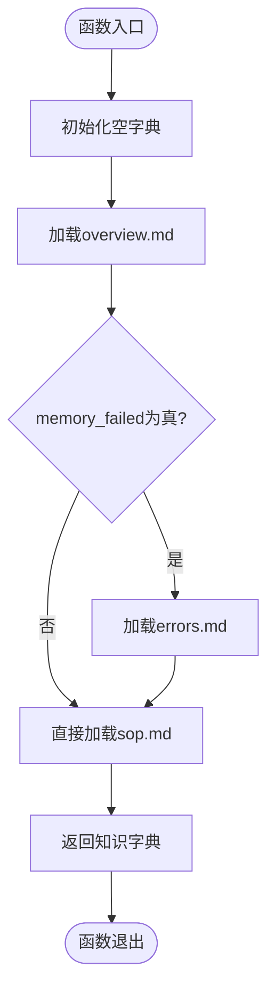
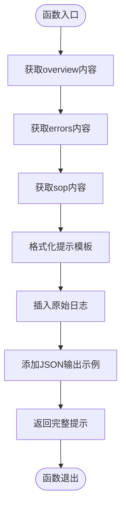
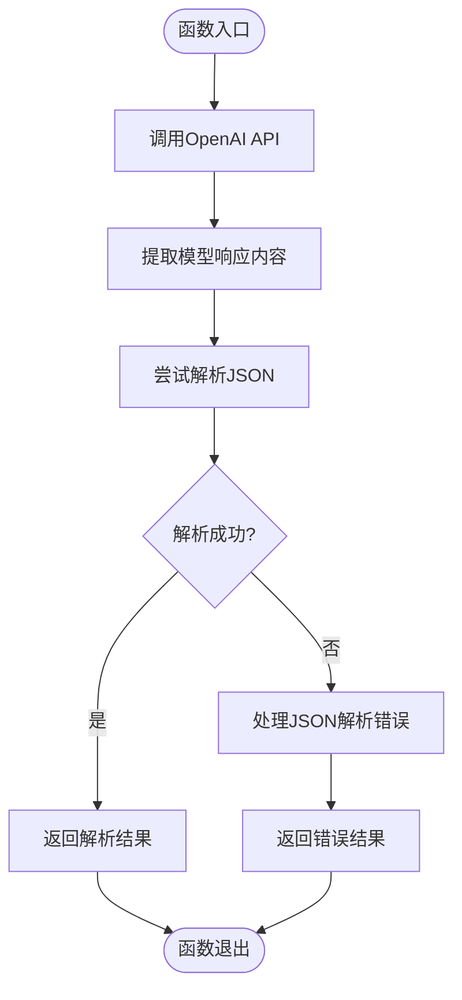
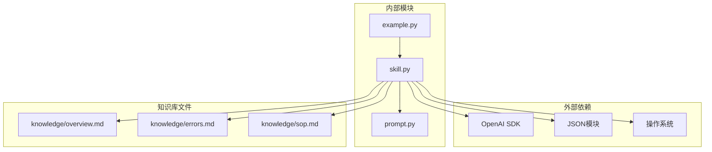

# 主控分析流程

<cite>
**本文档引用的文件**
- [skill.py](file://skill.py)
- [prompt.py](file://prompt.py)
- [example.py](file://example.py)
- [knowledge/overview.md](file://knowledge/overview.md)
- [knowledge/errors.md](file://knowledge/errors.md)
- [knowledge/sop.md](file://knowledge/sop.md)
</cite>

## 目录
1. [简介](#简介)
2. [项目结构](#项目结构)
3. [核心组件](#核心组件)
4. [架构概览](#架构概览)
5. [详细组件分析](#详细组件分析)
6. [依赖关系分析](#依赖关系分析)
7. [性能考虑](#性能考虑)
8. [故障排除指南](#故障排除指南)
9. [结论](#结论)

## 简介

本文档深入分析了主控分析流程 `analyze_log_skill` 的实现机制，该函数作为门面模式的统一入口，协调了日志解析、知识选择、提示构建和大语言模型调用四个核心模块，形成了完整的日志分析处理管道。该设计实现了关注点分离和流程解耦，为开发者提供了清晰的集成调用最佳实践和性能优化建议。

## 项目结构

该项目采用模块化设计，主要包含以下核心文件：

**图表来源**
- [skill.py](file://skill.py#L1-L69)
- [prompt.py](file://prompt.py#L1-L29)
- [example.py](file://example.py#L1-L40)

**章节来源**
- [skill.py](file://skill.py#L1-L69)
- [prompt.py](file://prompt.py#L1-L29)
- [example.py](file://example.py#L1-L40)

## 核心组件

### analyze_log_skill 函数

`analyze_log_skill` 是整个系统的核心入口函数，采用门面模式设计，对外提供统一的分析接口。该函数接收原始日志字符串，经过四个阶段的处理后返回结构化的分析结果。

**章节来源**
- [skill.py](file://skill.py#L63-L68)

### 模块化架构设计

系统采用模块化设计，每个功能模块都有明确的职责边界：

1. **parse_log**: 负责日志特征提取
2. **select_knowledge**: 负责知识库选择
3. **build_prompt**: 负责提示工程
4. **call_llm**: 负责与大语言模型交互

这种设计实现了高度的关注点分离，每个模块可以独立开发、测试和维护。

**章节来源**
- [skill.py](file://skill.py#L42-L68)

## 架构概览

下面的架构图展示了 `analyze_log_skill` 作为门面模式的完整工作流程：

**图表来源**
- [skill.py](file://skill.py#L63-L68)
- [prompt.py](file://prompt.py#L1-L29)

## 详细组件分析

### 门面模式实现机制

`analyze_log_skill` 函数完美体现了门面模式的设计原则：

**图表来源**
- [skill.py](file://skill.py#L42-L68)
- [prompt.py](file://prompt.py#L1-L29)

### 序列图：完整处理流程

**图表来源**
- [skill.py](file://skill.py#L63-L68)
- [prompt.py](file://prompt.py#L1-L29)

### 各模块详细分析

#### parse_log 模块

负责从原始日志中提取关键特征信息：

**图表来源**
- [skill.py](file://skill.py#L42-L47)

#### select_knowledge 模块

根据日志特征动态选择相关知识内容：

**图表来源**
- [skill.py](file://skill.py#L49-L61)

#### build_prompt 模块

将日志和知识内容组合成结构化的提示：

**图表来源**
- [prompt.py](file://prompt.py#L1-L29)

#### call_llm 模块

负责与大语言模型交互并处理响应：

**图表来源**
- [skill.py](file://skill.py#L18-L39)

**章节来源**
- [skill.py](file://skill.py#L42-L68)
- [prompt.py](file://prompt.py#L1-L29)

## 依赖关系分析

系统采用松耦合的模块化设计，各组件之间的依赖关系清晰明确：

**图表来源**
- [skill.py](file://skill.py#L1-L6)
- [prompt.py](file://prompt.py#L1-L29)
- [example.py](file://example.py#L1-L40)

**章节来源**
- [skill.py](file://skill.py#L1-L6)
- [prompt.py](file://prompt.py#L1-L29)
- [example.py](file://example.py#L1-L40)

## 性能考虑

### 优化策略

1. **缓存机制**
   - 缓存知识库内容，避免重复读取文件
   - 缓存LLM响应结果，支持相同日志的快速重算

2. **异步处理**
   - 对于批量日志分析，采用异步并发处理
   - 使用线程池管理LLM调用请求

3. **内存优化**
   - 流式处理大型日志文件
   - 及时释放中间结果和临时变量

4. **网络优化**
   - 实现重试机制和超时控制
   - 使用连接池复用网络连接

### 性能监控

建议在生产环境中添加以下监控指标：
- 单次分析耗时分布
- LLM调用成功率和延迟
- 知识库加载时间
- JSON解析错误率

## 故障排除指南

### 常见问题及解决方案

1. **LLM输出非JSON格式**
   - 系统已内置防御式JSON解析
   - 返回标准化错误结构，包含原始输出内容

2. **知识库文件缺失**
   - 检查文件路径是否正确
   - 确保文件权限可读
   - 提供默认知识内容

3. **网络连接问题**
   - 检查API密钥配置
   - 验证网络连通性
   - 实现重试机制

4. **内存不足**
   - 优化日志大小限制
   - 实施分批处理策略
   - 监控系统内存使用

**章节来源**
- [skill.py](file://skill.py#L30-L39)

## 结论

`analyze_log_skill` 函数通过门面模式设计，成功地将复杂的日志分析流程封装为简洁的统一接口。该设计实现了以下关键优势：

1. **关注点分离**：每个模块专注于特定功能，便于维护和扩展
2. **流程解耦**：模块间依赖关系清晰，支持独立演进
3. **可扩展性**：新增功能可通过添加新模块实现
4. **易用性**：对外提供简单一致的API接口

对于开发者而言，该架构提供了良好的集成基础，建议在实际部署中结合具体的业务需求进行定制化扩展，同时注重性能优化和错误处理机制的完善。