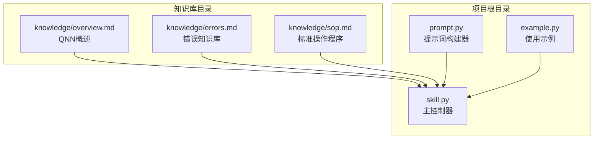
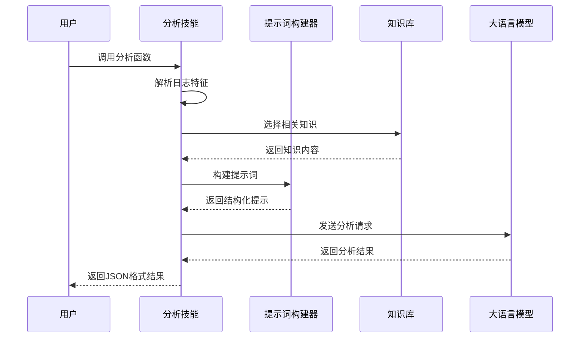
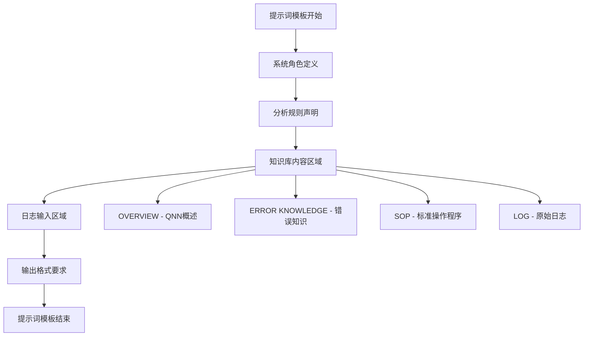
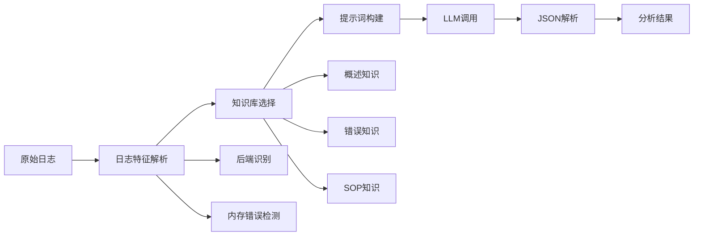
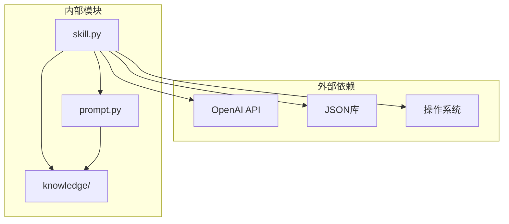

# 提示词构建

<cite>
**本文档引用的文件**
- [prompt.py](file://prompt.py)
- [skill.py](file://skill.py)
- [knowledge/overview.md](file://knowledge/overview.md)
- [knowledge/errors.md](file://knowledge/errors.md)
- [knowledge/sop.md](file://knowledge/sop.md)
- [example.py](file://example.py)
</cite>

## 目录
1. [简介](#简介)
2. [项目结构](#项目结构)
3. [核心组件](#核心组件)
4. [架构概览](#架构概览)
5. [详细组件分析](#详细组件分析)
6. [依赖关系分析](#依赖关系分析)
7. [性能考虑](#性能考虑)
8. [故障排除指南](#故障排除指南)
9. [结论](#结论)

## 简介

本项目是一个基于提示词构建的日志分析系统，专门用于分析Qualcomm QNN SDK运行时错误。该系统的核心功能是通过`build_prompt`函数将原始日志文本与知识库内容整合为结构化的LLM输入，从而帮助开发者快速定位和解决QNN运行时问题。

系统采用模块化设计，包含三个主要组件：
- **提示词构建器**：负责将日志和知识库内容组织成结构化的提示模板
- **知识库管理**：维护QNN相关的概述、错误知识和标准操作程序
- **LLM调用器**：与OpenAI API交互，执行实际的分析任务

## 项目结构

该项目采用简洁的模块化架构，文件组织清晰且职责明确：

**图表来源**
- [prompt.py](file://prompt.py#L1-L29)
- [skill.py](file://skill.py#L1-L69)
- [knowledge/overview.md](file://knowledge/overview.md#L1-L13)
- [knowledge/errors.md](file://knowledge/errors.md#L1-L74)
- [knowledge/sop.md](file://knowledge/sop.md#L1-L8)

**章节来源**
- [prompt.py](file://prompt.py#L1-L29)
- [skill.py](file://skill.py#L1-L69)
- [knowledge/overview.md](file://knowledge/overview.md#L1-L13)
- [knowledge/errors.md](file://knowledge/errors.md#L1-L74)
- [knowledge/sop.md](file://knowledge/sop.md#L1-L8)

## 核心组件

### 提示词构建器 (build_prompt)

`build_prompt`函数是整个系统的核心，它负责将多个数据源整合为LLM可理解的结构化输入。该函数接受两个参数：
- `log_text`：原始日志文本
- `knowledge`：包含知识库内容的字典

函数返回一个格式化的字符串，其中包含了完整的提示模板和约束条件。

**章节来源**
- [prompt.py](file://prompt.py#L1-L29)

### 知识库管理系统

系统维护了三个关键的知识库文件，每个都针对特定的分析场景：

1. **QNN概述**：提供基础概念和工作流程
2. **错误知识库**：详细记录各种QNN错误及其解决方案
3. **标准操作程序**：定义标准化的分析流程

**章节来源**
- [knowledge/overview.md](file://knowledge/overview.md#L1-L13)
- [knowledge/errors.md](file://knowledge/errors.md#L1-L74)
- [knowledge/sop.md](file://knowledge/sop.md#L1-L8)

### LLM集成层

`skill.py`文件实现了完整的LLM集成流程，包括：
- 系统级提示词定义
- LLM调用封装
- 错误处理和JSON解析
- 日志特征提取

**章节来源**
- [skill.py](file://skill.py#L1-L69)

## 架构概览

系统采用分层架构设计，确保了良好的模块分离和可维护性：

**图表来源**
- [skill.py](file://skill.py#L63-L68)
- [prompt.py](file://prompt.py#L1-L29)

## 详细组件分析

### 提示词模板设计

提示词模板采用了精心设计的四段式结构，每部分都有明确的功能和来源：

#### 模板结构分析

**图表来源**
- [prompt.py](file://prompt.py#L10-L28)

#### OVERVIEW部分 (QNN概述)

OVERVIEW部分提供了QNN SDK的基础知识框架，包括：
- 支持的后端类型（CPU、GPU、HTP）
- 典型的工作流程
- 架构概述

这部分内容为LLM提供了足够的背景知识，使其能够理解后续的错误分析上下文。

**章节来源**
- [knowledge/overview.md](file://knowledge/overview.md#L1-L13)
- [prompt.py](file://prompt.py#L10-L11)

#### ERROR KNOWLEDGE部分 (错误知识)

ERROR KNOWLEDGE部分包含了详细的错误分类和解决方案：
- 内存分配失败的各种场景
- 每种错误的典型日志模式
- 根因分析和具体解决方案
- 不同阶段的错误处理策略

该部分是系统的核心价值所在，直接决定了分析的准确性。

**章节来源**
- [knowledge/errors.md](file://knowledge/errors.md#L1-L74)
- [prompt.py](file://prompt.py#L13-L14)

#### SOP部分 (标准操作程序)

SOP部分定义了标准化的分析流程：
1. 识别后端类型
2. 提取错误代码
3. 定位失败阶段
4. 应用相应解决方案
5. 记录新案例

这个流程确保了分析的一致性和可重复性。

**章节来源**
- [knowledge/sop.md](file://knowledge/sop.md#L1-L8)
- [prompt.py](file://prompt.py#L16-L17)

#### LOG部分 (原始日志)

LOG部分直接嵌入了用户提供的原始日志内容，LLM需要基于这些具体的日志信息进行分析。

**章节来源**
- [prompt.py](file://prompt.py#L19-L20)

### 提示词设计原则

系统在提示词设计上遵循了严格的原则来确保输出质量和可靠性：

#### 禁止幻觉原则

通过明确的约束条件防止LLM生成不准确的信息：
- 仅使用提供的知识
- 不要编造API或参数
- 基于事实进行分析

#### 强制JSON输出原则

通过明确的输出格式要求确保结果的结构化：
- 输出必须是JSON格式
- 包含指定的字段结构
- 防御式JSON解析

#### 专注性原则

限制分析范围以提高准确性：
- 专注于后端、错误代码和失败阶段
- 避免无关信息干扰

**章节来源**
- [prompt.py](file://prompt.py#L5-L8)
- [skill.py](file://skill.py#L11-L15)

### 数据流处理

系统实现了完整的数据流处理管道：

**图表来源**
- [skill.py](file://skill.py#L42-L68)

**章节来源**
- [skill.py](file://skill.py#L42-L68)

## 依赖关系分析

系统具有清晰的依赖关系，确保了模块间的松耦合：

**图表来源**
- [skill.py](file://skill.py#L1-L6)
- [prompt.py](file://prompt.py#L1-L1)

### 模块间关系

系统采用单向依赖模式，避免了循环依赖：
- `skill.py`依赖于`prompt.py`
- `skill.py`依赖于知识库文件
- `prompt.py`不依赖任何其他模块

这种设计确保了良好的可测试性和可维护性。

**章节来源**
- [skill.py](file://skill.py#L1-L6)
- [prompt.py](file://prompt.py#L1-L1)

## 性能考虑

### 温度参数调优

系统使用较低的温度值（0.1）来确保分析的稳定性：
- 减少创造性输出
- 提高结果的一致性
- 适合技术文档分析场景

### 缓存策略

虽然当前实现没有显式的缓存机制，但可以考虑以下优化：
- 知识库内容缓存
- LLM调用结果缓存
- 特征提取结果缓存

### 批处理支持

当前版本支持单个日志分析，可以扩展为批处理模式：
- 并行处理多个日志
- 批量LLM调用
- 统一的结果聚合

## 故障排除指南

### 常见问题及解决方案

#### JSON解析失败

当LLM输出不是有效JSON时，系统会返回默认的错误结构：
- 包含错误原因说明
- 空的解决方案列表
- 置零的置信度
- 原始输出保留

#### 知识库加载失败

如果知识库文件无法读取，系统会使用空字符串作为占位符：
- 确保系统稳定性
- 避免中断分析流程
- 允许部分知识可用

#### LLM调用异常

网络或API问题可能导致调用失败：
- 实现重试机制
- 添加超时处理
- 提供降级方案

**章节来源**
- [skill.py](file://skill.py#L30-L39)

### 调试技巧

#### 日志分析特征

系统提供了基本的日志分析能力：
- 后端类型识别（HTP/UNKNOWN）
- 内存错误检测
- 关键词匹配

#### 结果验证

建议的验证方法：
- 检查输出JSON结构
- 验证置信度合理性
- 对比不同日志的分析结果

## 结论

本项目展示了如何构建一个专业化的提示词构建系统，通过精心设计的模板结构和严格的约束条件，成功地将复杂的日志分析任务转化为结构化的LLM输入。

### 主要优势

1. **结构化输出**：通过强制JSON格式确保结果的可解析性
2. **知识驱动**：基于权威知识库提供准确的分析
3. **可扩展性**：模块化设计便于功能扩展
4. **稳定性**：防御式编程确保系统可靠性

### 改进建议

1. **增强特征提取**：添加更多日志模式识别
2. **实现缓存机制**：提高系统响应速度
3. **添加监控指标**：跟踪分析效果
4. **支持多语言**：扩展国际化能力

该系统为类似的技术文档分析任务提供了一个优秀的参考实现，其设计理念和架构模式值得在其他领域推广应用。