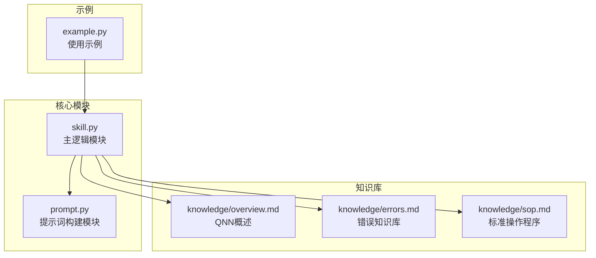
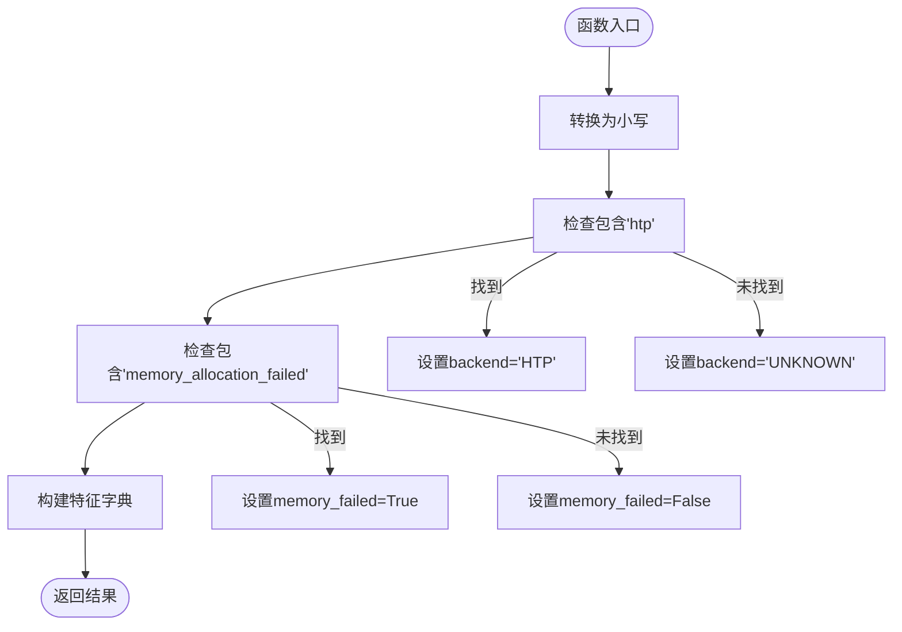
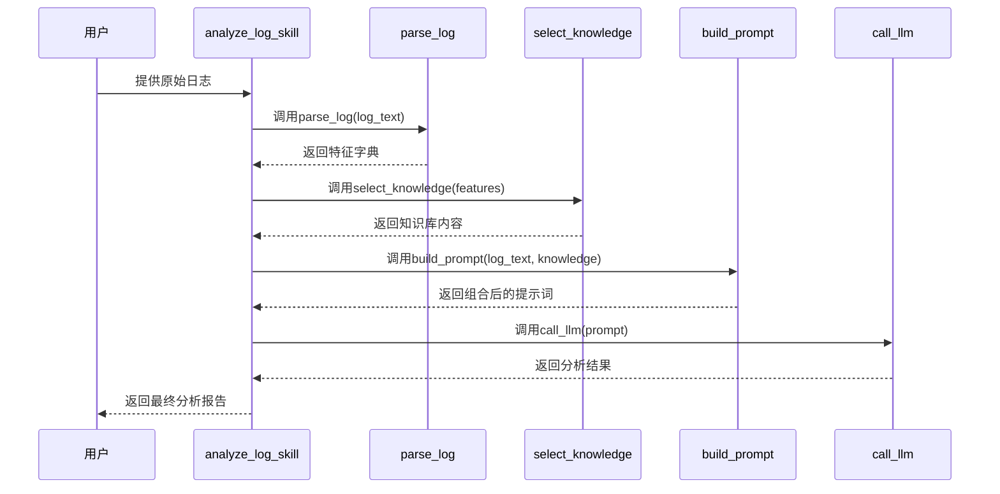
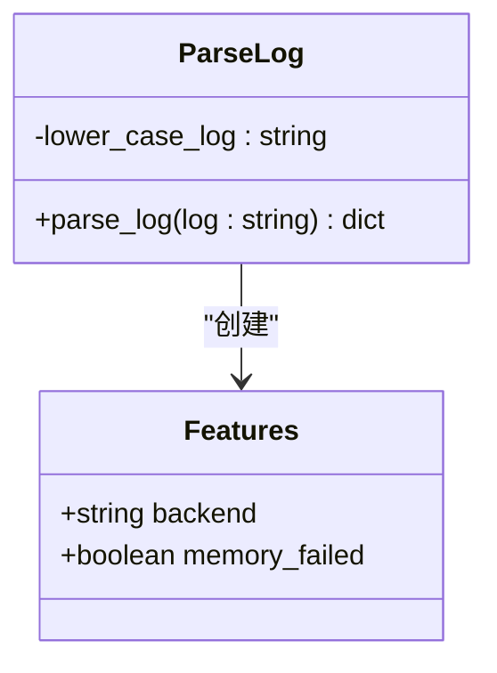
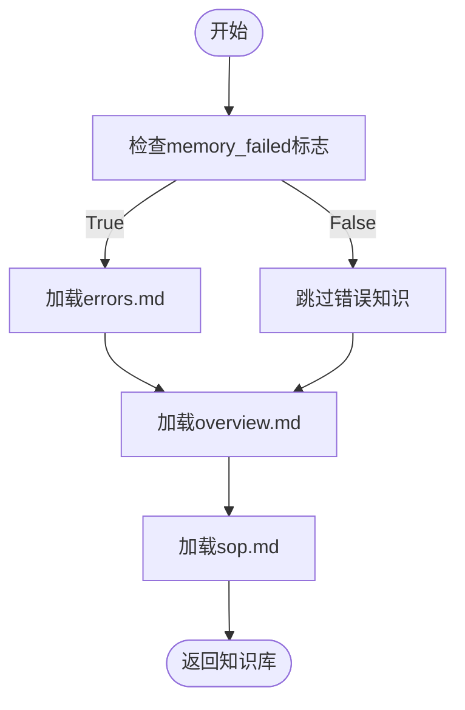
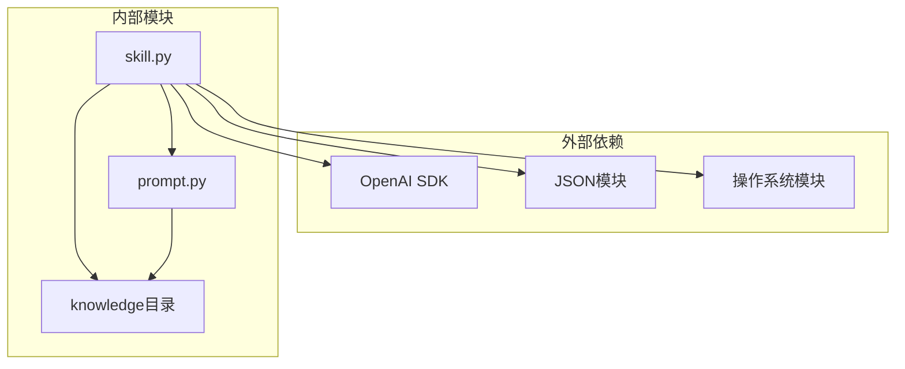

# 日志特征提取

<cite>
**本文档引用的文件**
- [skill.py](file://skill.py)
- [example.py](file://example.py)
- [prompt.py](file://prompt.py)
- [knowledge/errors.md](file://knowledge/errors.md)
- [knowledge/overview.md](file://knowledge/overview.md)
- [knowledge/sop.md](file://knowledge/sop.md)
</cite>

## 目录
1. [简介](#简介)
2. [项目结构](#项目结构)
3. [核心组件](#核心组件)
4. [架构概览](#架构概览)
5. [详细组件分析](#详细组件分析)
6. [依赖关系分析](#依赖关系分析)
7. [性能考虑](#性能考虑)
8. [故障排除指南](#故障排除指南)
9. [结论](#结论)

## 简介

本项目实现了QNN（Qualcomm Neural Network）日志分析系统中的日志特征提取功能。该功能是管道-过滤器架构的第一阶段，负责从原始QNN日志中提取关键特征，特别是后端类型和内存分配失败标志。本文档详细解释了`parse_log`函数的工作原理，包括其基于字符串匹配的实现机制，并讨论了当前实现的局限性和可能的改进方向。

## 项目结构

该项目采用模块化设计，主要包含以下组件：



**图表来源**
- [skill.py](file://skill.py#L1-L69)
- [prompt.py](file://prompt.py#L1-L29)

**章节来源**
- [skill.py](file://skill.py#L1-L69)
- [example.py](file://example.py#L1-L40)

## 核心组件

### parse_log函数

`parse_log`函数是日志特征提取的核心组件，位于`skill.py`文件中第42-47行。该函数接收原始日志文本作为输入，返回包含关键特征的字典。

#### 主要功能特性

1. **大小写不敏感处理**：函数将输入日志转换为小写形式，确保匹配的可靠性
2. **后端类型检测**：识别HTP（Hexagon Tensor Processor）后端
3. **内存分配失败标记**：检测内存分配失败的标志

#### 实现机制



**图表来源**
- [skill.py](file://skill.py#L42-L47)

**章节来源**
- [skill.py](file://skill.py#L42-L47)

## 架构概览

该系统采用管道-过滤器架构，其中日志特征提取是第一阶段：



**图表来源**
- [skill.py](file://skill.py#L63-L68)
- [prompt.py](file://prompt.py#L1-L29)

## 详细组件分析

### 特征提取算法

#### 后端类型检测

后端检测通过简单的字符串包含检查实现：
- 检查日志是否包含"htp"子串
- 如果找到，标记为"HTP"后端
- 否则标记为"UNKNOWN"

#### 内存分配失败检测

内存分配失败检测同样基于字符串匹配：
- 检查日志是否包含"memory_allocation_failed"子串
- 如果找到，设置`memory_failed`为True
- 否则设置为False

#### 输出特征字典结构



**图表来源**
- [skill.py](file://skill.py#L42-L47)

**章节来源**
- [skill.py](file://skill.py#L42-L47)

### 知识库选择策略

`select_knowledge`函数根据特征提取结果动态选择相应的知识库内容：



**图表来源**
- [skill.py](file://skill.py#L49-L61)

**章节来源**
- [skill.py](file://skill.py#L49-L61)

### 实际应用示例

系统提供了三个完整的日志分析示例，展示了不同场景下的特征提取效果：

#### 示例1：设备初始化失败
- 后端：HTP
- 错误：QNN_STATUS_MEMORY_ALLOCATION_FAILED
- 失败阶段：设备初始化

#### 示例2：图创建失败  
- 后端：HTP
- 错误：QNN_STATUS_MEMORY_ALLOCATION_FAILED
- 失败阶段：图创建

#### 示例3：推理执行失败
- 后端：HTP
- 错误：QNN_STATUS_MEMORY_ALLOCATION_FAILED
- 失败阶段：推理执行

**章节来源**
- [example.py](file://example.py#L3-L28)

## 依赖关系分析



**图表来源**
- [skill.py](file://skill.py#L1-L6)
- [prompt.py](file://prompt.py#L1-L29)

**章节来源**
- [skill.py](file://skill.py#L1-L6)
- [prompt.py](file://prompt.py#L1-L29)

## 性能考虑

### 时间复杂度分析

- **字符串预处理**：O(n)，其中n为日志长度
- **后端检测**：O(n)，使用Python内置的`in`操作符
- **内存失败检测**：O(n)，同样使用`in`操作符
- **总体复杂度**：O(n)

### 空间复杂度分析

- **输入日志副本**：O(n)
- **特征字典**：O(1)
- **总体空间复杂度**：O(n)

### 优化建议

1. **编译正则表达式**：预编译常用的匹配模式
2. **早期退出**：在找到所有必要特征后提前结束
3. **缓存机制**：对频繁使用的知识库内容进行缓存

## 故障排除指南

### 常见问题诊断

#### 特征提取不准确

**症状**：后端类型被错误识别或内存失败标志缺失

**排查步骤**：
1. 检查日志中是否包含正确的关键词
2. 验证大小写转换是否正确
3. 确认日志格式是否符合预期

#### 知识库选择错误

**症状**：选择了不相关的知识库内容

**排查步骤**：
1. 打印特征字典验证`memory_failed`标志
2. 检查知识库文件是否存在且可访问
3. 验证文件路径配置

### 调试建议

#### 开发者调试技巧

1. **添加日志输出**：
```python
def debug_parse_log(log: str) -> dict:
    print(f"原始日志: {log}")
    result = parse_log(log)
    print(f"特征结果: {result}")
    return result
```

2. **单元测试**：
```python
def test_parse_log():
    test_cases = [
        ("HTP", "memory_allocation_failed"),
        ("CPU", "device_create_failed"),
        ("GPU", "graph_create_failed")
    ]
    
    for backend, error_type in test_cases:
        log = f"Using backend: {backend}\nError code: {error_type}"
        features = parse_log(log)
        print(f"输入: {log}")
        print(f"输出: {features}")
```

3. **边界情况测试**：
- 大小写混合的日志
- 缺少特定关键词的日志
- 包含多个后端信息的日志

#### 验证特征提取准确性的方法

1. **人工验证**：手动检查关键特征是否正确提取
2. **回归测试**：维护历史日志样本的预期结果
3. **覆盖率测试**：确保覆盖所有支持的后端类型和错误类型

## 结论

日志特征提取模块作为QNN日志分析系统的入口点，虽然实现相对简单，但具有重要的作用。其基于字符串匹配的实现方式简洁高效，能够快速识别关键特征并驱动后续的知识库选择策略。

### 当前实现的优势

1. **简单可靠**：基于Python内置字符串操作，代码简洁易懂
2. **性能优秀**：线性时间复杂度，适合处理大量日志数据
3. **易于维护**：逻辑清晰，修改成本低

### 主要局限性

1. **匹配方式单一**：仅依赖简单的字符串包含检查
2. **缺乏上下文理解**：无法理解复杂的日志语境和关系
3. **扩展性有限**：新增特征类型需要修改核心逻辑

### 改进建议

1. **正则表达式增强**：
```python
import re

# 更精确的后端检测
backend_pattern = re.compile(r'(cpu|gpu|htp)', re.IGNORECASE)

# 更精确的错误码提取
error_pattern = re.compile(r'qnn_status_memory_allocation_failed', re.IGNORECASE)
```

2. **多错误检测支持**：
```python
def enhanced_parse_log(log: str) -> dict:
    features = {}
    lower_log = log.lower()
    
    # 支持多种错误类型的检测
    error_types = {
        'memory_allocation_failed': 'memory_failed',
        'device_create_failed': 'device_failed',
        'graph_create_failed': 'graph_failed'
    }
    
    for error_pattern, feature_name in error_types.items():
        if error_pattern in lower_log:
            features[feature_name] = True
    
    return features
```

3. **上下文感知匹配**：
```python
def context_aware_parse_log(log: str) -> dict:
    lines = log.split('\n')
    features = {'backend': 'UNKNOWN', 'memory_failed': False}
    
    for line in lines:
        line_lower = line.lower()
        if 'using backend:' in line_lower:
            if 'htp' in line_lower:
                features['backend'] = 'HTP'
        
        if 'memory allocation failed' in line_lower:
            features['memory_failed'] = True
    
    return features
```

该模块为整个QNN日志分析系统奠定了坚实的基础，通过持续的改进和扩展，可以更好地支持更复杂的日志分析需求。