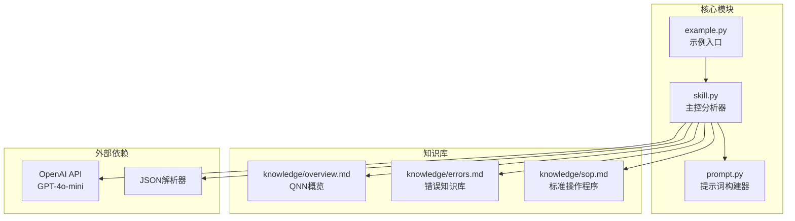
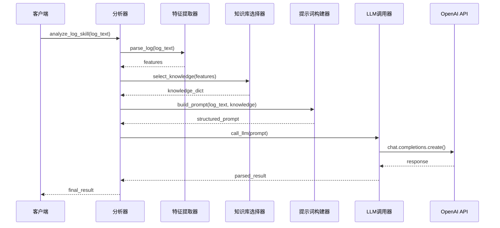
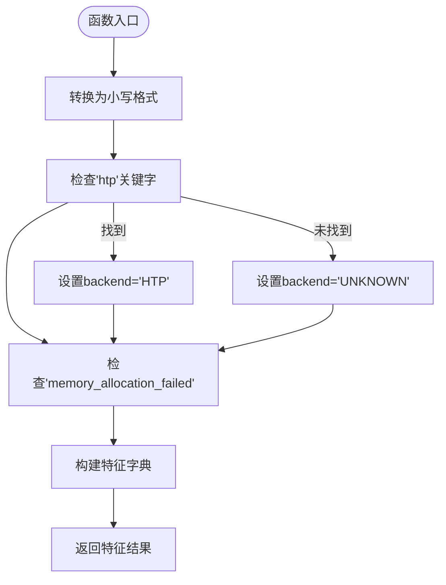
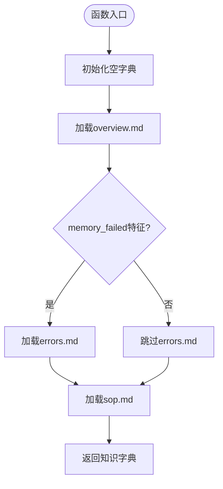
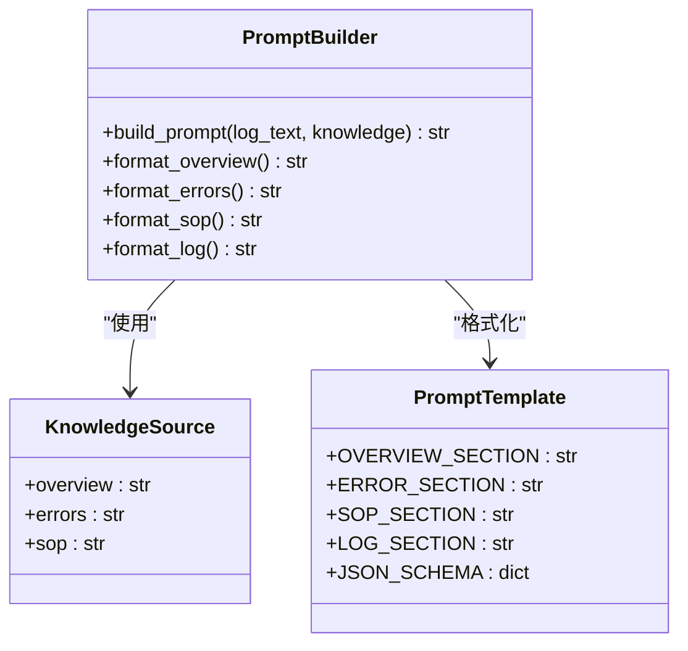
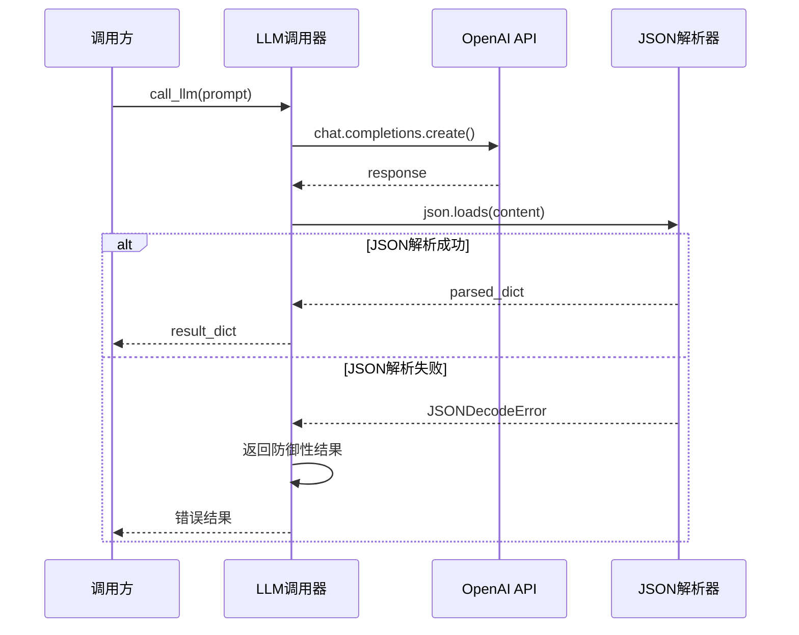
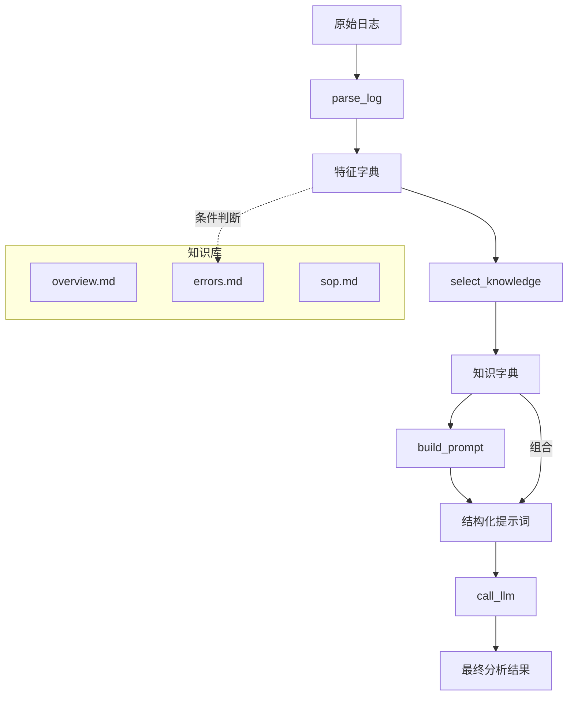
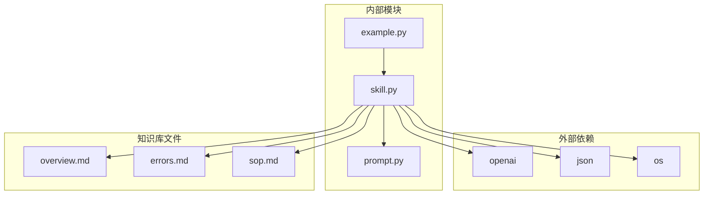

# 核心功能

<cite>
**本文档引用的文件**
- [skill.py](file://skill.py)
- [prompt.py](file://prompt.py)
- [example.py](file://example.py)
- [knowledge/overview.md](file://knowledge/overview.md)
- [knowledge/errors.md](file://knowledge/errors.md)
- [knowledge/sop.md](file://knowledge/sop.md)
</cite>

## 目录
1. [简介](#简介)
2. [项目结构](#项目结构)
3. [核心组件](#核心组件)
4. [架构总览](#架构总览)
5. [详细组件分析](#详细组件分析)
6. [依赖关系分析](#依赖关系分析)
7. [性能考虑](#性能考虑)
8. [故障排除指南](#故障排除指南)
9. [结论](#结论)

## 简介
本项目是一个专门针对Qualcomm QNN SDK运行时的日志分析系统，采用门面模式设计，提供从原始日志到结构化解析结果的完整处理流水线。系统通过四个核心处理阶段：日志特征提取、知识库选择、提示词构建和LLM调用，实现对QNN运行时错误的智能诊断。

该系统特别专注于识别后端类型（特别是HTP后端）和内存分配失败等关键错误模式，为开发者提供准确的根因分析和解决方案建议。

## 项目结构
项目采用简洁的模块化设计，主要包含以下组件：

**图表来源**
- [skill.py](file://skill.py#L1-L69)
- [prompt.py](file://prompt.py#L1-L29)
- [example.py](file://example.py#L1-L40)

**章节来源**
- [skill.py](file://skill.py#L1-L69)
- [prompt.py](file://prompt.py#L1-L29)
- [example.py](file://example.py#L1-L40)

## 核心组件
系统由六个核心组件构成，每个组件都有明确的职责分工：

### 主控分析器 (analyze_log_skill)
作为门面模式的核心协调者，负责编排整个分析流程，确保各组件按正确顺序执行。

### 日志特征提取器 (parse_log)
负责从原始日志文本中提取关键特征信息，包括后端类型识别和内存分配失败检测。

### 知识库选择器 (select_knowledge)
基于提取的特征动态选择相应的知识文件，实现策略模式的知识库加载机制。

### 提示词构建器 (build_prompt)
将结构化的知识内容与原始日志整合，生成符合LLM要求的提示词模板。

### LLM调用器 (call_llm)
负责与OpenAI API交互，执行推理任务，并实现防御式JSON解析机制。

### 知识库管理
包含三个专门的知识库文件，提供不同维度的专业知识支持。

**章节来源**
- [skill.py](file://skill.py#L42-L68)
- [prompt.py](file://prompt.py#L1-L29)

## 架构总览
系统采用分层架构设计，通过门面模式统一对外接口，内部实现模块化处理：

**图表来源**
- [skill.py](file://skill.py#L63-L68)
- [skill.py](file://skill.py#L18-L39)
- [prompt.py](file://prompt.py#L1-L29)

## 详细组件分析

### 日志特征提取模块 (parse_log)
该模块实现了高效的字符串匹配算法来识别关键特征：

**图表来源**
- [skill.py](file://skill.py#L42-L47)

特征提取的关键设计决策：
- 使用小写转换确保匹配的鲁棒性
- 后端识别优先级：HTP > UNKNOWN，体现对特定后端的关注
- 内存分配失败检测采用精确的关键字匹配

**章节来源**
- [skill.py](file://skill.py#L42-L47)

### 知识库选择模块 (select_knowledge)
实现基于特征的策略模式，动态加载相应的知识文件：

**图表来源**
- [skill.py](file://skill.py#L49-L61)

选择策略的设计考量：
- 始终加载概述知识，提供基础上下文
- 仅在检测到内存分配失败时才加载错误知识
- 总是加载标准操作程序，确保流程完整性

**章节来源**
- [skill.py](file://skill.py#L49-L61)

### 提示词构建模块 (build_prompt)
将多源知识整合为结构化的提示词模板：

**图表来源**
- [prompt.py](file://prompt.py#L1-L29)

提示词构建的设计原则：
- 严格的分节格式，便于LLM理解和处理
- 明确的JSON输出约束，确保结构化结果
- 包含完整的知识来源标识，增强可追溯性

**章节来源**
- [prompt.py](file://prompt.py#L1-L29)

### LLM调用模块 (call_llm)
实现防御式的API调用和结果解析：

**图表来源**
- [skill.py](file://skill.py#L18-L39)

防御式解析的关键特性：
- 严格限制温度参数为0.1，确保输出稳定性
- 捕获所有JSON解析异常
- 提供结构化的错误回退机制

**章节来源**
- [skill.py](file://skill.py#L18-L39)

### 主控分析流程 (analyze_log_skill)
作为门面模式的协调中心，实现完整的分析工作流：

**图表来源**
- [skill.py](file://skill.py#L63-L68)

门面模式的优势：
- 简化客户端接口，隐藏内部复杂性
- 统一错误处理和日志记录
- 支持扩展新的处理步骤而不影响现有代码

**章节来源**
- [skill.py](file://skill.py#L63-L68)

## 依赖关系分析

**图表来源**
- [skill.py](file://skill.py#L1-L6)
- [example.py](file://example.py#L1)

**章节来源**
- [skill.py](file://skill.py#L1-L6)
- [example.py](file://example.py#L1)

## 性能考虑
系统在设计时充分考虑了性能和可靠性：

### 温度参数优化
- 将temperature设置为0.1，确保LLM输出的确定性和一致性
- 适用于日志分析场景，避免不必要的创造性输出
- 提高分析结果的可重复性

### 文件I/O优化
- 知识库文件采用延迟加载策略
- 仅在需要时读取相关知识文件
- 减少不必要的磁盘访问

### 内存使用优化
- 字符串处理采用就地转换，减少内存复制
- 知识库内容按需加载，避免一次性占用大量内存

## 故障排除指南

### 常见问题及解决方案

**LLM输出非JSON格式**
- 系统已内置防御式解析机制
- 自动捕获JSONDecodeError异常
- 返回标准化的错误结果结构

**知识库文件缺失**
- 系统会优雅地处理文件不存在的情况
- 相关知识段落将为空字符串
- 分析流程不会中断

**API调用失败**
- OpenAI API异常会被捕获和处理
- 提供详细的错误信息和重试建议

**章节来源**
- [skill.py](file://skill.py#L30-L39)

## 结论
本QNN日志分析系统通过精心设计的模块化架构，实现了从原始日志到结构化分析结果的完整自动化流程。系统的核心优势包括：

1. **模块化设计**：清晰的职责分离和接口定义
2. **策略模式应用**：动态知识库选择机制
3. **防御式编程**：完善的错误处理和回退机制
4. **门面模式**：简化的对外接口和统一的控制流程

该系统为QNN SDK用户提供了一个可靠、可扩展的日志分析工具，能够有效识别和诊断常见的运行时错误，特别是HTP后端的内存分配问题，为开发者提供准确的根因分析和解决方案建议。