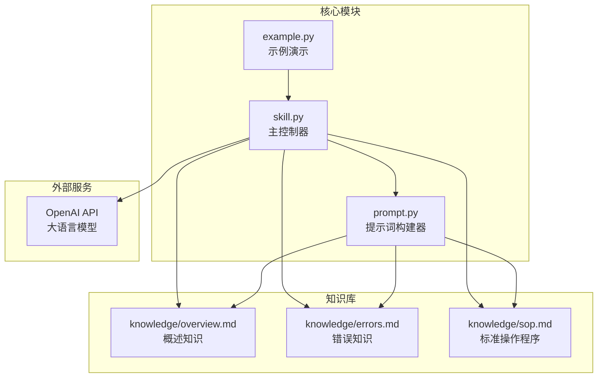
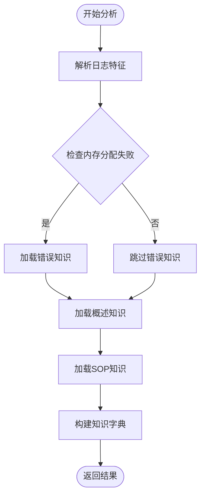
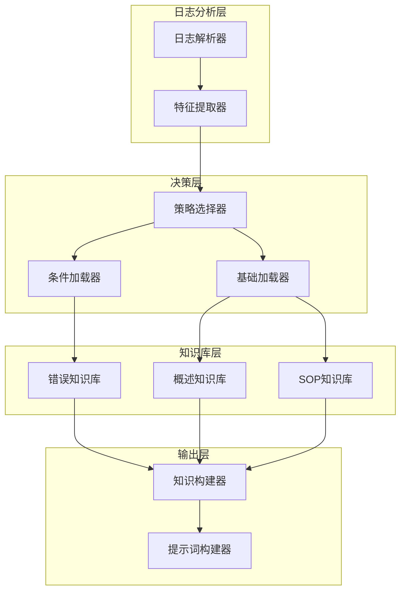
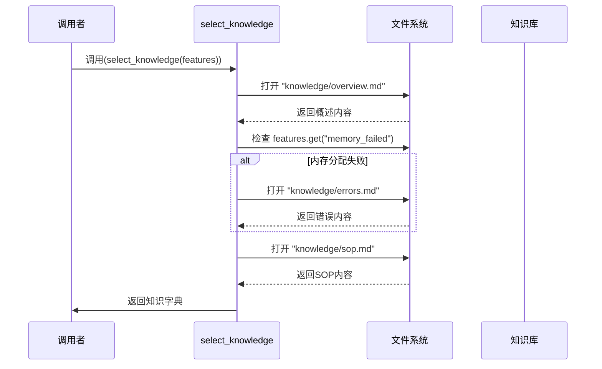
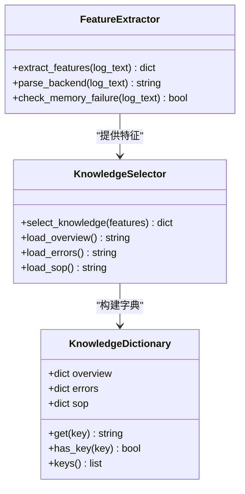
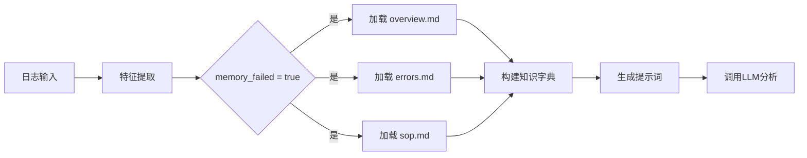
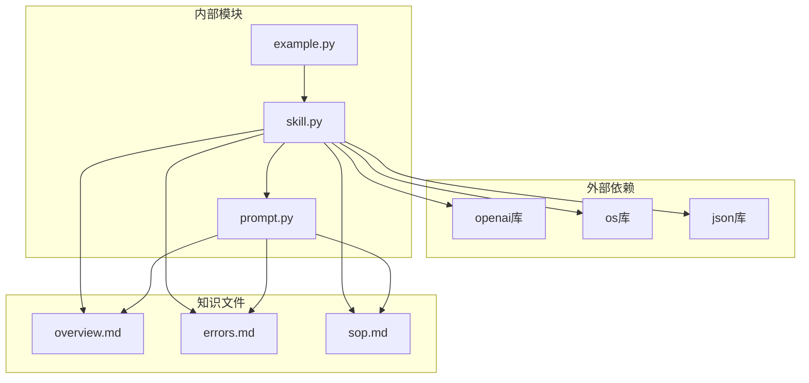

# 知识库选择

<cite>
**本文档引用的文件**
- [skill.py](file://skill.py)
- [prompt.py](file://prompt.py)
- [example.py](file://example.py)
- [knowledge/overview.md](file://knowledge/overview.md)
- [knowledge/errors.md](file://knowledge/errors.md)
- [knowledge/sop.md](file://knowledge/sop.md)
</cite>

## 目录
1. [简介](#简介)
2. [项目结构](#项目结构)
3. [核心组件](#核心组件)
4. [架构概览](#架构概览)
5. [详细组件分析](#详细组件分析)
6. [依赖关系分析](#依赖关系分析)
7. [性能考虑](#性能考虑)
8. [故障排除指南](#故障排除指南)
9. [结论](#结论)
10. [扩展指南](#扩展指南)

## 简介

本项目是一个基于大语言模型的 Qualcomm QNN SDK 运行时日志分析技能。知识库选择模块是整个系统的核心组件之一，负责根据日志特征动态加载相应的知识文件，实现了按需加载和条件性知识组合的智能策略。

该模块采用策略模式设计，能够根据检测到的日志特征（如内存分配失败）智能地选择和加载相应的知识文件，同时确保基础知识（overview.md 和 sop.md）始终被加载，从而在保证分析准确性的同时优化资源使用。

## 项目结构

项目采用简洁的模块化设计，主要包含以下组件：



**图表来源**
- [skill.py](file://skill.py#L1-L69)
- [prompt.py](file://prompt.py#L1-L29)
- [example.py](file://example.py#L1-L40)

**章节来源**
- [skill.py](file://skill.py#L1-L69)
- [prompt.py](file://prompt.py#L1-L29)
- [example.py](file://example.py#L1-L40)

## 核心组件

### 知识库选择器 (Knowledge Selector)

知识库选择器是系统的核心组件，负责根据日志特征动态选择和加载知识文件。其主要职责包括：

1. **特征提取**：从原始日志中提取关键特征
2. **条件判断**：根据特征决定是否加载特定知识文件
3. **知识聚合**：构建完整的知识字典供后续分析使用

### 策略模式实现

系统采用策略模式实现条件性知识加载：



**图表来源**
- [skill.py](file://skill.py#L42-L61)

**章节来源**
- [skill.py](file://skill.py#L42-L61)

## 架构概览

整个知识库选择模块的架构设计体现了高内聚、低耦合的设计原则：



**图表来源**
- [skill.py](file://skill.py#L42-L61)
- [prompt.py](file://prompt.py#L1-L29)

## 详细组件分析

### select_knowledge 函数详解

`select_knowledge` 函数是知识库选择模块的核心实现，采用了经典的策略模式：

#### 函数签名与参数
- **输入参数**：features (dict) - 包含日志特征的字典
- **返回值**：dict - 包含加载知识内容的字典

#### 执行流程



**图表来源**
- [skill.py](file://skill.py#L49-L61)

#### 条件性加载逻辑

系统实现了严格的条件性加载策略：

1. **基础知识强制加载**：
   - `overview.md`：始终加载，提供系统概述和背景知识
   - `sop.md`：始终加载，提供标准化的操作流程

2. **条件性知识加载**：
   - `errors.md`：仅当检测到内存分配失败时加载
   - 基于特征字典中的 `memory_failed` 键进行判断

#### 文件读取机制

文件读取采用同步阻塞方式，具有以下特点：

- **路径固定**：所有知识文件位于 `knowledge/` 目录下
- **编码统一**：默认使用 UTF-8 编码读取
- **异常处理**：当前实现未包含显式的文件读取异常处理

**章节来源**
- [skill.py](file://skill.py#L49-L61)

### 知识字典构建过程

知识字典的构建遵循严格的键值对映射规则：

| 键名 | 对应文件 | 加载条件 | 用途 |
|------|----------|----------|------|
| "overview" | overview.md | 始终 | 提供系统概述和背景信息 |
| "errors" | errors.md | 仅内存分配失败 | 提供错误诊断和解决方案 |
| "sop" | sop.md | 始终 | 提供标准化操作流程 |

#### 数据结构设计



**图表来源**
- [skill.py](file://skill.py#L42-L61)

**章节来源**
- [skill.py](file://skill.py#L42-L61)

### 具体示例分析

#### 示例1：设备初始化阶段内存分配失败

对于包含 `qnn_htp_device_create failed` 和 `QNN_STATUS_MEMORY_ALLOCATION_FAILED` 的日志：



**图表来源**
- [example.py](file://example.py#L3-L9)
- [skill.py](file://skill.py#L49-L61)

#### 示例2：图创建阶段内存分配失败

对于包含 `qnn_graph_create failed` 和 `QNN_STATUS_MEMORY_ALLOCATION_FAILED` 的日志：


**图表来源**
- [example.py](file://example.py#L10-L18)
- [skill.py](file://skill.py#L49-L61)

#### 示例3：推理执行阶段内存分配失败

对于包含 `qnn_execute_graph failed` 和 `QNN_STATUS_MEMORY_ALLOCATION_FAILED` 的日志：


**图表来源**
- [example.py](file://example.py#L19-L28)
- [skill.py](file://skill.py#L49-L61)

**章节来源**
- [example.py](file://example.py#L1-L40)

## 依赖关系分析

### 组件间依赖关系



**图表来源**
- [skill.py](file://skill.py#L1-L6)
- [prompt.py](file://prompt.py#L1-L29)
- [example.py](file://example.py#L1-L2)

### 外部依赖分析

系统对外部依赖的使用体现了最小化原则：

1. **OpenAI API 客户端**：用于调用大语言模型服务
2. **操作系统接口**：用于文件系统操作
3. **JSON 解析器**：用于结构化数据处理

**章节来源**
- [skill.py](file://skill.py#L1-L6)

## 性能考虑

### 时间复杂度分析

知识库选择模块的时间复杂度为 O(n)，其中 n 是知识文件数量：

- **文件读取**：O(k) - k 为知识文件数量
- **字符串匹配**：O(m) - m 为日志长度
- **整体复杂度**：O(k + m)

### 空间复杂度分析

空间复杂度主要由加载的知识内容决定：

- **知识字典**：O(K) - K 为所有知识内容的总字符数
- **特征字典**：O(1) - 固定大小的特征集合

### 性能优化建议

1. **缓存机制**：可以考虑缓存已加载的知识内容
2. **异步加载**：对于大量知识文件时可考虑异步加载
3. **增量更新**：支持知识库的增量更新而非全量重新加载

## 故障排除指南

### 常见问题及解决方案

#### 文件路径问题

**问题描述**：知识文件无法找到或路径不正确

**可能原因**：
- 工作目录与预期不符
- 知识文件路径配置错误
- 权限不足访问知识文件

**解决方案**：
- 使用绝对路径替代相对路径
- 添加文件存在性检查
- 实施更健壮的异常处理机制

#### 内存分配失败检测

**问题描述**：内存分配失败的检测不够准确

**可能原因**：
- 日志格式变化导致匹配失败
- 特殊字符影响字符串匹配
- 多种错误类型混淆

**解决方案**：
- 实施正则表达式匹配
- 添加多关键词组合验证
- 支持模糊匹配和相似度计算

#### JSON 解析异常

**问题描述**：大语言模型输出的JSON解析失败

**可能原因**：
- LLM输出格式不符合预期
- 特殊字符导致JSON格式错误
- 输出截断或不完整

**解决方案**：
- 实施更宽松的JSON解析策略
- 添加输出格式验证
- 提供降级处理方案

**章节来源**
- [skill.py](file://skill.py#L30-L39)

## 结论

知识库选择模块通过策略模式实现了灵活的知识管理机制，具有以下显著优势：

### 设计优势

1. **按需加载**：仅在需要时加载相关知识，减少内存占用
2. **条件性组合**：根据日志特征动态组合知识，提高分析准确性
3. **基础保障**：确保核心知识（概述和SOP）始终可用
4. **扩展性强**：易于添加新的知识文件和选择条件

### 潜在风险

1. **路径硬编码**：知识文件路径直接写在代码中，不利于配置管理
2. **异常处理不足**：缺乏完善的错误处理和恢复机制
3. **性能瓶颈**：文件I/O操作可能成为性能瓶颈
4. **维护成本**：条件判断逻辑可能随时间增长而变得复杂

## 扩展指南

### 添加新的知识文件

要添加新的知识文件，需要进行以下步骤：

1. **创建知识文件**：在 `knowledge/` 目录下添加新的 `.md` 文件
2. **更新选择逻辑**：修改 `select_knowledge` 函数以包含新的选择条件
3. **更新提示词构建**：修改 `build_prompt` 函数以包含新知识的占位符
4. **测试集成**：编写测试用例验证新功能

#### 新知识文件集成示例

```python
def select_knowledge(features: dict) -> dict:
    k = {}
    
    # 始终加载的基础知识
    with open("knowledge/overview.md") as f:
        k["overview"] = f.read()
    
    # 条件性加载的现有知识
    if features.get("memory_failed"):
        with open("knowledge/errors.md") as f:
            k["errors"] = f.read()
    
    # 新增的条件性知识
    if features.get("new_condition"):
        with open("knowledge/new_knowledge.md") as f:
            k["new_knowledge"] = f.read()
    
    # 始终加载的SOP
    with open("knowledge/sop.md") as f:
        k["sop"] = f.read()
    
    return k
```

### 扩展选择条件

要添加新的选择条件，可以：

1. **扩展特征提取**：在 `parse_log` 函数中添加新的特征提取逻辑
2. **更新条件判断**：在 `select_knowledge` 中添加对应的条件分支
3. **更新知识内容**：创建相应的知识文件提供支持

#### 新特征提取示例

```python
def parse_log(log: str) -> dict:
    l = log.lower()
    return {
        "backend": "HTP" if "htp" in l else "UNKNOWN",
        "memory_failed": "memory_allocation_failed" in l,
        "new_condition": "new_keyword" in l  # 新增特征
    }
```

### 配置化改进

为了提高系统的灵活性，建议实施以下改进：

1. **配置文件**：使用配置文件管理知识文件路径和加载策略
2. **插件机制**：支持动态加载新的知识文件和选择条件
3. **缓存策略**：实现知识内容的缓存机制
4. **监控指标**：添加性能监控和使用统计

通过这些扩展，知识库选择模块可以更好地适应不断变化的需求，在保持现有优势的同时提升系统的可维护性和可扩展性。