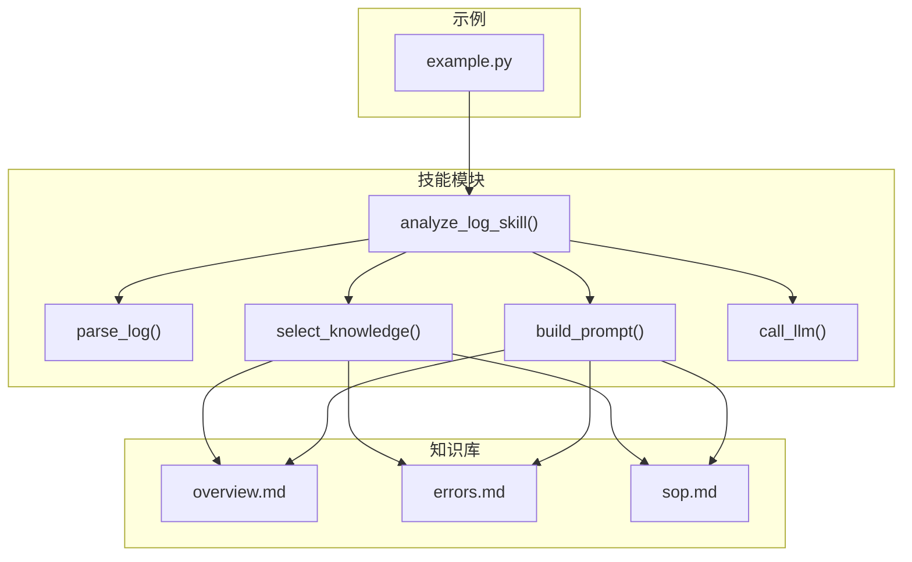
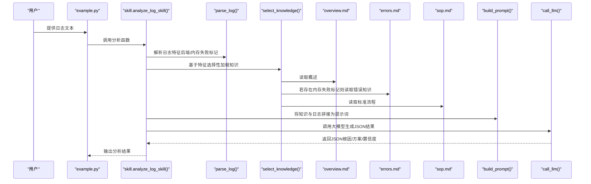
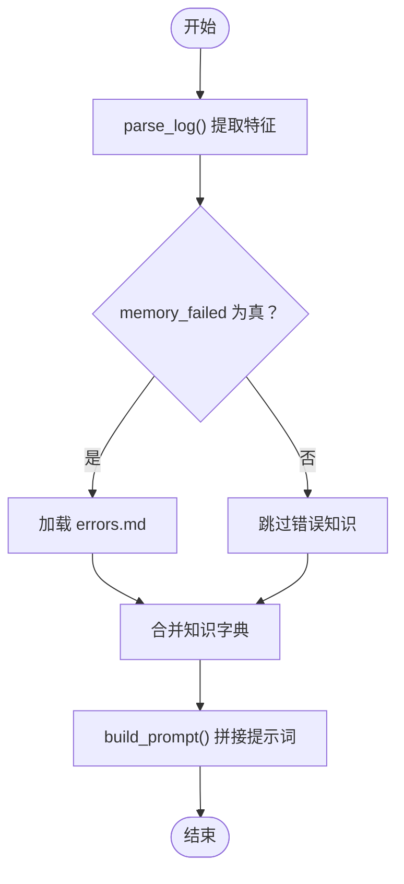
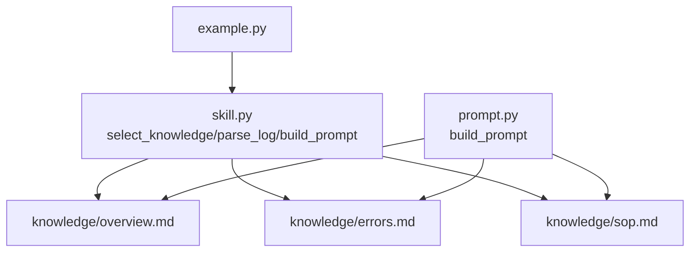

# 知识库管理

<cite>
**本文引用的文件**
- [knowledge/overview.md](file://knowledge/overview.md)
- [knowledge/errors.md](file://knowledge/errors.md)
- [knowledge/sop.md](file://knowledge/sop.md)
- [skill.py](file://skill.py)
- [prompt.py](file://prompt.py)
- [example.py](file://example.py)
</cite>

## 目录
1. [简介](#简介)
2. [项目结构](#项目结构)
3. [核心组件](#核心组件)
4. [架构总览](#架构总览)
5. [详细组件分析](#详细组件分析)
6. [依赖关系分析](#依赖关系分析)
7. [性能考虑](#性能考虑)
8. [故障排查指南](#故障排查指南)
9. [结论](#结论)
10. [附录](#附录)

## 简介
本文件面向需要维护与扩展QNN日志分析技能的知识库管理，重点说明以下三类知识文件的作用与维护方式：
- overview.md：提供QNN SDK的基本概念与典型工作流程，帮助理解上下文背景。
- errors.md：按QNN_STATUS错误码组织的根因与解决方案，覆盖设备初始化、图创建、推理执行等阶段。
- sop.md：标准化处理流程（SOP），指导从识别后端到记录新案例的完整步骤。

同时，本文将解释如何通过修改知识文件而非代码扩展系统功能，给出新增错误类型的命名规范、内容格式与条件加载逻辑（如基于memory_failed特征的select_knowledge函数），并提供最佳实践与示例路径，帮助在不改动核心代码的前提下持续增强日志分析能力。

## 项目结构
该项目采用“知识文件 + 技能模块 + 提示词构建 + 示例调用”的分层设计：
- knowledge目录存放三类知识文件，分别对应概述、错误知识与标准流程。
- skill.py负责解析日志特征、选择性加载知识、构建提示词并调用大模型推理。
- prompt.py将知识与日志拼接为最终提示词模板。
- example.py演示了对不同阶段失败的日志进行分析的使用方式。

图表来源
- [skill.py](file://skill.py#L42-L68)
- [prompt.py](file://prompt.py#L1-L29)
- [example.py](file://example.py#L1-L40)

章节来源
- [skill.py](file://skill.py#L1-L69)
- [prompt.py](file://prompt.py#L1-L29)
- [example.py](file://example.py#L1-L40)

## 核心组件
- 概述知识（overview.md）
  - 作用：介绍QNN SDK、常见后端（CPU/GPU/HTP）与典型运行流程（模型加载 -> 后端初始化 -> 图创建 -> 推理）。
  - 维护要点：保持简洁、聚焦于运行时背景，避免深入实现细节。
- 错误知识（errors.md）
  - 结构：按QNN_STATUS错误码分节，每节包含典型日志、根因、解决方案；针对不同阶段（设备初始化/图创建/推理运行时）细分。
  - 维护要点：确保错误码命名一致、阶段描述准确、方案可操作且无冗余。
- 标准流程（sop.md）
  - 结构：五步法（识别后端 -> 提取错误码 -> 定位阶段 -> 应用方案 -> 记录新案例）。
  - 维护要点：流程清晰、步骤可执行、便于补充新错误类型时复用。

章节来源
- [knowledge/overview.md](file://knowledge/overview.md#L1-L13)
- [knowledge/errors.md](file://knowledge/errors.md#L1-L74)
- [knowledge/sop.md](file://knowledge/sop.md#L1-L8)

## 架构总览
下图展示了从日志输入到最终JSON输出的完整流程，强调知识库的选择性加载与提示词构建：

图表来源
- [skill.py](file://skill.py#L42-L68)
- [prompt.py](file://prompt.py#L1-L29)
- [example.py](file://example.py#L1-L40)

## 详细组件分析

### 概述知识（overview.md）
- 内容定位：提供QNN SDK背景、常见后端与典型流程，作为所有分析的基础上下文。
- 维护策略：保持语言简洁、术语统一；避免引入具体API或参数细节，防止误导。
- 使用方式：始终被select_knowledge加载，作为提示词的[OVERVIEW]部分。

章节来源
- [knowledge/overview.md](file://knowledge/overview.md#L1-L13)
- [skill.py](file://skill.py#L49-L61)
- [prompt.py](file://prompt.py#L10-L11)

### 错误知识（errors.md）
- 结构化组织：每个QNN_STATUS错误码一个章节，章节标题包含阶段后缀（如“(Device Initialization)”），典型日志、根因、解决方案三段式。
- 分类维度：按阶段细分为设备初始化、图创建、推理运行时等，便于快速定位。
- 维护要点：
  - 错误码命名一致性：遵循“QNN_STATUS_...”的统一前缀与语义化阶段后缀。
  - 典型日志真实可检索：包含可匹配的关键字或错误字符串，便于后续特征提取与条件加载。
  - 解决方案可操作：列出具体可行的步骤，避免空泛表述。
  - 避免重复：同一错误的不同表现应合并到同一章节，通过典型日志体现差异。

章节来源
- [knowledge/errors.md](file://knowledge/errors.md#L1-L74)
- [skill.py](file://skill.py#L49-L61)
- [prompt.py](file://prompt.py#L13-L14)

### 标准流程（sop.md）
- 流程目标：提供标准化的排障步骤，确保每次分析都遵循一致的思维路径。
- 维护要点：步骤顺序合理、覆盖关键环节；当新增错误类型时，优先在现有SOP中扩展，减少重复定义。

章节来源
- [knowledge/sop.md](file://knowledge/sop.md#L1-L8)
- [skill.py](file://skill.py#L49-L61)
- [prompt.py](file://prompt.py#L16-L17)

### 条件加载逻辑（select_knowledge）
- 功能概述：根据parse_log提取的特征决定是否加载错误知识，从而影响提示词内容与最终分析范围。
- 关键点：
  - 特征提取：parse_log会检测是否存在“memory_allocation_failed”关键词，生成memory_failed布尔值。
  - 条件加载：当memory_failed为真时，select_knowledge才读取errors.md；否则仅加载overview与sop。
  - 可扩展性：新增条件只需在parse_log中增加特征字段，并在select_knowledge中添加分支，无需修改提示词模板与LLM调用逻辑。

图表来源
- [skill.py](file://skill.py#L42-L68)
- [prompt.py](file://prompt.py#L1-L29)

章节来源
- [skill.py](file://skill.py#L42-L68)
- [prompt.py](file://prompt.py#L1-L29)

### 提示词构建（build_prompt）
- 功能概述：将知识库与日志文本拼接为最终提示词，限定模型只能基于提供的知识回答。
- 关键点：
  - 模板化结构：明确的[OVERVIEW]、[ERROR KNOWLEDGE]、[SOP]与[LOG]分区。
  - 约束规则：禁止编造API或参数，输出必须为JSON。
  - 扩展友好：新增知识文件只需在select_knowledge中加入加载逻辑，build_prompt即可自动纳入。

章节来源
- [prompt.py](file://prompt.py#L1-L29)
- [skill.py](file://skill.py#L49-L61)

### 示例调用（example.py）
- 功能概述：演示对三种不同阶段失败的日志进行分析，展示知识库在不同场景下的选择性加载。
- 关键点：通过构造包含特定关键字的日志，触发不同的特征与知识加载组合，验证系统鲁棒性。

章节来源
- [example.py](file://example.py#L1-L40)
- [skill.py](file://skill.py#L63-L68)

## 依赖关系分析
- 知识库与技能模块的耦合关系：
  - select_knowledge直接依赖知识文件路径与内容；新增知识文件需在此处注册加载。
  - parse_log的特征直接影响知识加载分支，因此新增错误类型时应同步完善特征提取逻辑。
  - build_prompt对知识的依赖是静态的键名约定（overview/errors/sop），扩展时保持键名不变即可。
- 外部依赖：
  - skill.py依赖OpenAI客户端进行推理调用；prompt.py依赖知识字典键名约定。
- 耦合与内聚：
  - 知识库与代码解耦良好：通过文件路径与键名约定实现松耦合。
  - 新增错误类型无需修改核心逻辑，仅需在知识文件中补充并在select_knowledge中声明加载。

图表来源
- [skill.py](file://skill.py#L42-L68)
- [prompt.py](file://prompt.py#L1-L29)
- [example.py](file://example.py#L1-L40)

章节来源
- [skill.py](file://skill.py#L1-L69)
- [prompt.py](file://prompt.py#L1-L29)
- [example.py](file://example.py#L1-L40)

## 性能考虑
- 文件I/O开销：每次分析都会读取知识文件，建议在高并发场景下考虑缓存策略（例如在进程内缓存知识内容）。
- LLM调用成本：当前温度较低，有助于稳定输出；可根据需求调整模型与温度以平衡质量与成本。
- 特征提取复杂度：parse_log为线性扫描，开销极小；新增特征时注意避免过多正则匹配导致性能下降。

## 故障排查指南
- 常见问题与解决思路：
  - 错误知识未生效：检查select_knowledge中是否正确加载对应知识文件；确认parse_log特征提取是否命中。
  - 提示词缺失：确认build_prompt中键名与select_knowledge返回的键一致。
  - LLM输出非JSON：当前已内置防御式解析，若仍失败，检查提示词约束与模型稳定性。
- 日志特征不准确：
  - 若新增错误类型但未触发知识加载，检查日志中是否包含可被parse_log识别的关键字。
- 新增错误类型流程：
  - 在errors.md中新增章节，遵循统一的标题与三段式结构。
  - 在select_knowledge中添加必要的加载逻辑（如需基于新特征条件加载）。
  - 更新example.py中的测试用例，验证新场景的覆盖。

章节来源
- [skill.py](file://skill.py#L18-L40)
- [prompt.py](file://prompt.py#L1-L29)
- [example.py](file://example.py#L1-L40)

## 结论
本知识库管理方案通过“文件即知识”的方式实现了与代码的低耦合扩展：新增错误类型与流程改进只需修改知识文件与选择性加载逻辑，无需改动核心推理链路。遵循统一的命名规范、结构化格式与条件加载策略，可确保知识库的可维护性与可扩展性，持续提升日志分析的覆盖面与准确性。

## 附录

### 新增错误类型的实践指南
- 命名规范
  - 错误码章节标题：使用“QNN_STATUS_...”前缀，阶段后缀采用括号形式（如“(Device Initialization)”）。
  - 阶段后缀建议：Device Initialization / Graph Create / Inference Runtime。
- 内容格式
  - 典型日志：列出可检索的关键字与错误字符串，便于特征提取与条件加载。
  - 根因：分点列举可能原因，避免主观臆断。
  - 解决方案：分条列出可执行步骤，优先考虑降低资源占用与回退策略。
- 条件加载逻辑
  - 若新错误类型需要独立的条件加载，应在parse_log中新增特征提取，在select_knowledge中添加分支加载对应知识文件。
  - 保持键名约定（overview/errors/sop）不变，确保build_prompt可无缝接入。
- 最佳实践
  - 保持知识条目的原子性：每个章节聚焦单一错误码与阶段。
  - 避免信息重复：同类问题归并到同一章节，通过典型日志体现差异。
  - 定期更新：结合新日志样本与反馈，持续优化根因与解决方案。
- 示例路径（不展示具体内容，仅提供修改位置）
  - 新增错误章节：在 [knowledge/errors.md](file://knowledge/errors.md#L1-L74) 中追加新章节。
  - 条件加载扩展：在 [skill.py](file://skill.py#L49-L61) 的select_knowledge中添加分支。
  - 特征提取扩展：在 [skill.py](file://skill.py#L42-L47) 的parse_log中增加特征字段。
  - 提示词模板：在 [prompt.py](file://prompt.py#L1-L29) 中确认键名一致。
  - 场景验证：在 [example.py](file://example.py#L1-L40) 中新增测试用例，验证新错误类型的覆盖。