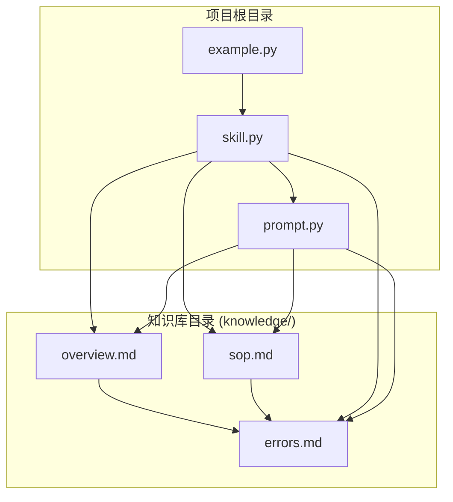
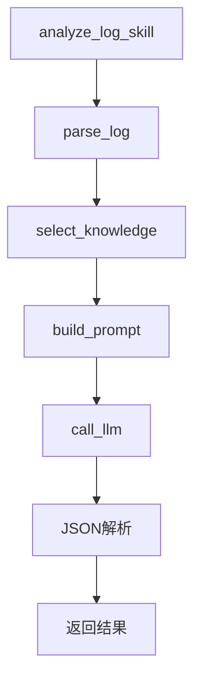
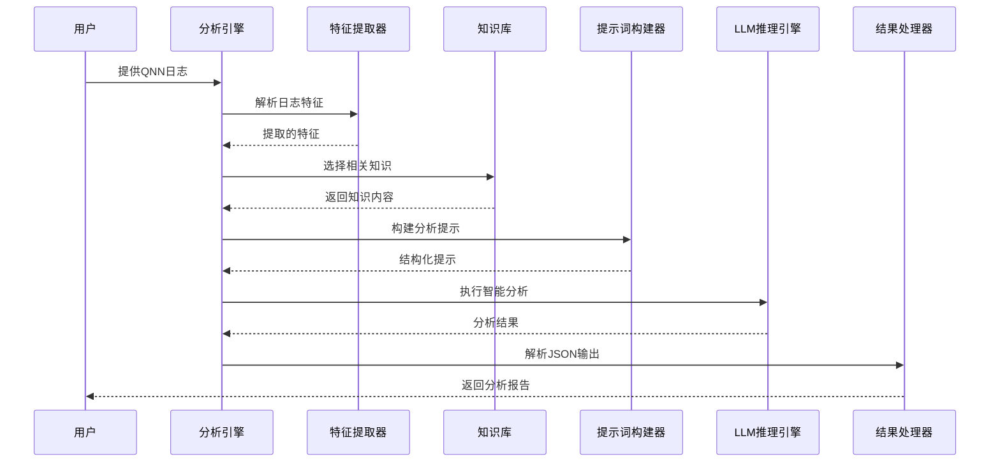
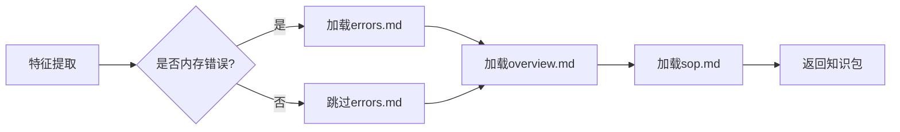
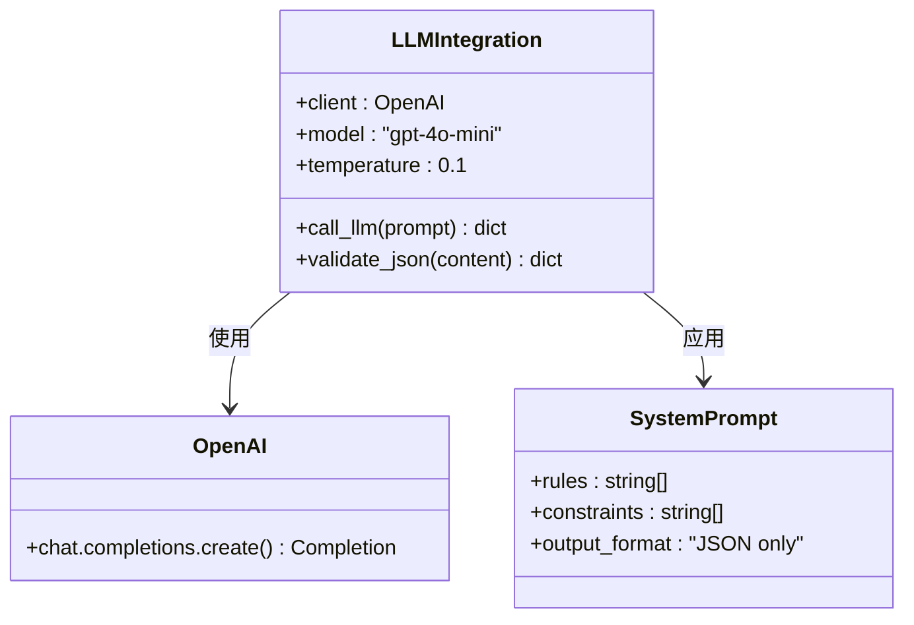
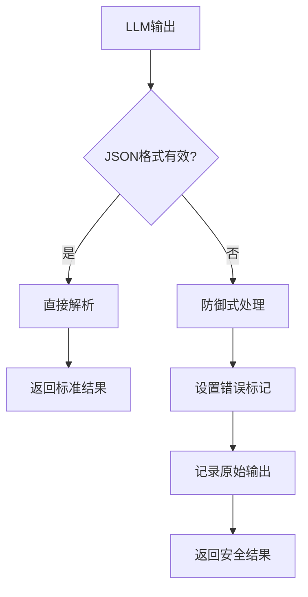
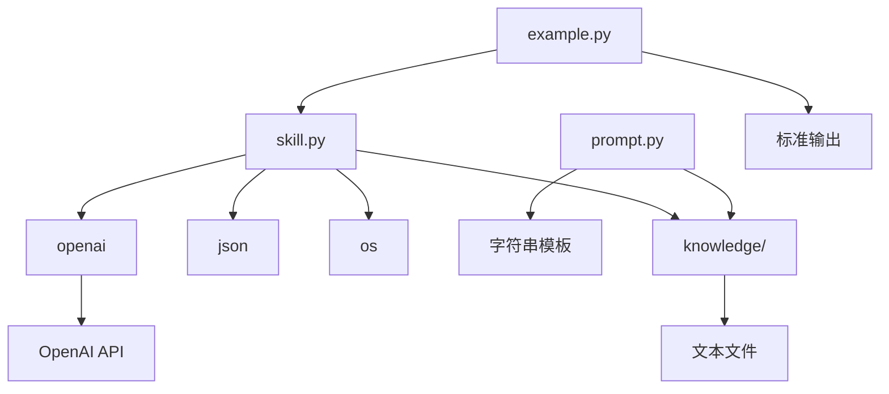

# QNN日志智能分析工具项目文档

<cite>
**本文档中引用的文件**
- [knowledge/errors.md](file://knowledge/errors.md)
- [knowledge/overview.md](file://knowledge/overview.md)
- [knowledge/sop.md](file://knowledge/sop.md)
- [example.py](file://example.py)
- [prompt.py](file://prompt.py)
- [skill.py](file://skill.py)
</cite>

## 目录
1. [项目简介](#项目简介)
2. [项目结构](#项目结构)
3. [核心组件](#核心组件)
4. [架构概览](#架构概览)
5. [详细组件分析](#详细组件分析)
6. [依赖关系分析](#依赖关系分析)
7. [性能考虑](#性能考虑)
8. [故障排除指南](#故障排除指南)
9. [结论](#结论)

## 项目简介

QNN日志智能分析工具是一个专门针对Qualcomm QNN SDK运行时日志的智能分析系统。该工具利用大型语言模型（LLM）技术，能够自动识别QNN运行时错误、定位根本原因并提供针对性的解决方案建议。

### 核心功能特性

- **自动化错误识别**：通过分析QNN运行时日志，自动识别各种类型的错误状态码
- **根因分析**：深入分析错误发生的阶段和根本原因
- **智能解决方案推荐**：基于知识库提供可执行的解决方案建议
- **多后端支持**：支持CPU、GPU和HTP三种不同的QNN后端
- **阶段化诊断**：能够精确定位错误发生在设备初始化、图创建还是推理执行阶段

### 技术架构优势

该系统采用管道-过滤器模式，实现了清晰的数据处理流程：
```
原始日志 → 特征提取 → 知识库选择 → 提示词构建 → LLM推理 → 结果返回
```

## 项目结构

项目采用模块化设计，主要包含以下目录和文件：



**图表来源**
- [skill.py](file://skill.py#L1-L69)
- [prompt.py](file://prompt.py#L1-L29)

### 文件组织结构

- **skill.py**：主分析引擎，包含核心逻辑和LLM调用
- **prompt.py**：提示词构建模块，负责生成结构化的分析提示
- **example.py**：示例演示文件，展示典型使用场景
- **knowledge/**：知识库目录，包含QNN相关的专业知识

**章节来源**
- [skill.py](file://skill.py#L1-L69)
- [prompt.py](file://prompt.py#L1-L29)
- [example.py](file://example.py#L1-L40)

## 核心组件

### 分析引擎 (skill.py)

分析引擎是整个系统的中枢，负责协调各个组件完成完整的日志分析流程。

#### 主要职责
- **特征提取**：从原始日志中提取关键信息（后端类型、错误状态等）
- **知识库管理**：根据分析特征动态选择合适的知识库
- **LLM集成**：与OpenAI API交互，执行智能分析
- **结果解析**：将LLM输出转换为结构化JSON格式

#### 关键函数



**图表来源**
- [skill.py](file://skill.py#L63-L68)

**章节来源**
- [skill.py](file://skill.py#L1-L69)

### 提示词构建器 (prompt.py)

提示词构建器负责将原始日志和知识库信息转换为LLM可理解的结构化提示。

#### 设计原则
- **最小化提示**：只包含必要的上下文信息
- **结构化输出**：强制要求LLM输出JSON格式
- **知识边界**：严格限制LLM只能使用提供的知识

#### 输出格式
```json
{
  "root_cause": "字符串",
  "solutions": ["数组"],
  "confidence": 0.0
}
```

**章节来源**
- [prompt.py](file://prompt.py#L1-L29)

### 示例演示 (example.py)

示例文件展示了三种典型的QNN错误场景：

1. **设备初始化失败**：HTP设备创建阶段的内存分配错误
2. **图创建失败**：模型加载后的图准备阶段错误
3. **推理执行失败**：正常推理过程中的运行时错误

**章节来源**
- [example.py](file://example.py#L1-L40)

## 架构概览

系统采用管道-过滤器模式，每个组件都有明确的职责分工：



**图表来源**
- [skill.py](file://skill.py#L63-L68)
- [prompt.py](file://prompt.py#L1-L29)

### 数据流处理

系统遵循严格的处理流程：

1. **输入接收**：接收原始QNN运行时日志
2. **特征提取**：识别后端类型和错误状态
3. **知识匹配**：根据特征选择相应的知识库
4. **提示构建**：生成结构化的分析提示
5. **智能推理**：LLM执行深度分析
6. **结果解析**：转换为标准化JSON格式

## 详细组件分析

### 特征提取模块

特征提取器负责从原始日志中识别关键信息：

```mermaid
flowchart TD
A[原始日志] --> B[转换为小写]
B --> C{检查后端类型}
C --> |包含"htp"| D[标记为HTP]
C --> |其他| E[标记为UNKNOWN]
B --> F{检查错误状态}
F --> |包含"memory_allocation_failed"| G[标记为内存错误]
F --> |其他| H[标记为非内存错误]
D --> I[返回特征]
E --> I
G --> I
H --> I
```

**图表来源**
- [skill.py](file://skill.py#L42-L47)

#### 提取的特征类型

| 特征名称 | 用途 | 示例 |
|---------|------|------|
| backend | 后端类型识别 | HTP/CPU/GPU |
| memory_failed | 错误状态检测 | True/False |

**章节来源**
- [skill.py](file://skill.py#L42-L47)

### 知识库管理系统

知识库系统根据分析特征动态选择相关信息：



**图表来源**
- [skill.py](file://skill.py#L49-L61)

#### 知识库内容结构

| 文件 | 内容类型 | 用途 |
|------|----------|------|
| overview.md | QNN SDK概述 | 提供背景知识 |
| errors.md | 错误案例库 | 具体问题分析 |
| sop.md | 标准操作程序 | 解决方案框架 |

**章节来源**
- [skill.py](file://skill.py#L49-L61)

### LLM集成层

LLM集成层负责与OpenAI API交互，执行智能分析：



**图表来源**
- [skill.py](file://skill.py#L18-L39)

#### 系统提示设计原则

系统提示严格限制LLM的行为：

- **知识边界**：只能使用提供的知识
- **输出约束**：必须输出JSON格式
- **专业领域**：专注于QNN SDK运行时分析
- **准确性优先**：避免臆测API或参数

**章节来源**
- [skill.py](file://skill.py#L8-L16)

### 结果解析器

结果解析器负责将LLM的自然语言输出转换为结构化数据：



**图表来源**
- [skill.py](file://skill.py#L30-L39)

#### 安全处理机制

- **异常捕获**：防止JSON解析错误
- **降级策略**：当LLM输出无效时提供替代方案
- **完整性保证**：确保始终返回标准的JSON结构

**章节来源**
- [skill.py](file://skill.py#L30-L39)

## 依赖关系分析

### 外部依赖



**图表来源**
- [skill.py](file://skill.py#L1-L6)
- [prompt.py](file://prompt.py#L1-L29)

### 内部模块依赖

| 模块 | 依赖模块 | 用途 |
|------|----------|------|
| skill.py | prompt.py | 获取提示词构建函数 |
| skill.py | knowledge/ | 加载知识库内容 |
| prompt.py | knowledge/ | 获取知识库内容 |
| example.py | skill.py | 调用分析功能 |

**章节来源**
- [skill.py](file://skill.py#L1-L6)
- [prompt.py](file://prompt.py#L1-L29)

## 性能考虑

### 计算效率优化

1. **特征提取优化**：使用简单的字符串匹配，时间复杂度O(n)
2. **按需知识加载**：仅在需要时加载相关知识库文件
3. **缓存策略**：可以考虑添加知识库内容缓存机制

### LLM调用优化

- **温度参数调优**：使用0.1的低温度值确保输出稳定性
- **模型选择**：使用"gpt-4o-mini"平衡性能和成本
- **批量处理**：当前版本支持单次分析，可扩展为批量处理

### 内存使用优化

- **流式读取**：知识库文件采用一次性读取
- **字符串处理**：使用小写转换减少比较开销
- **JSON解析**：仅解析必需字段

## 故障排除指南

### 常见问题及解决方案

#### LLM输出格式错误

**问题症状**：返回包含错误标记的结果对象

**可能原因**：
- LLM未能正确遵循JSON输出规则
- 网络传输过程中出现格式问题

**解决步骤**：
1. 检查系统提示是否正确传递
2. 验证温度参数设置（应为0.1）
3. 确认网络连接稳定

#### 知识库文件访问失败

**问题症状**：分析过程中抛出文件访问异常

**可能原因**：
- 知识库文件路径不正确
- 权限不足
- 文件编码问题

**解决步骤**：
1. 验证knowledge目录结构
2. 检查文件权限设置
3. 确认文件编码为UTF-8

#### API密钥配置问题

**问题症状**：OpenAI API调用失败

**可能原因**：
- API密钥无效或过期
- 网络连接问题
- 配额限制

**解决步骤**：
1. 验证API密钥格式
2. 检查网络连接
3. 确认账户状态正常

**章节来源**
- [skill.py](file://skill.py#L30-L39)

## 结论

QNN日志智能分析工具是一个设计精良的日志分析系统，具有以下显著特点：

### 技术优势

- **模块化架构**：采用管道-过滤器模式，组件职责清晰
- **知识驱动**：基于结构化的知识库提供准确分析
- **安全性设计**：多重防护机制确保输出质量
- **扩展性强**：易于添加新的错误类型和解决方案

### 应用价值

该工具为QNN SDK用户提供了：
- 快速的问题诊断能力
- 可执行的解决方案建议
- 标准化的分析流程
- 降低技术支持成本

### 发展前景

未来可以考虑的功能增强：
- 支持更多QNN错误类型
- 添加机器学习模型进行智能分类
- 实现Web界面和API服务
- 集成实时日志监控功能
- 添加多语言支持

这个项目展示了如何将LLM技术有效地应用于特定领域的日志分析任务，为类似的应用开发提供了良好的参考范例。