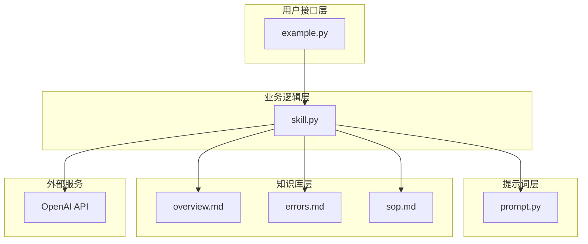
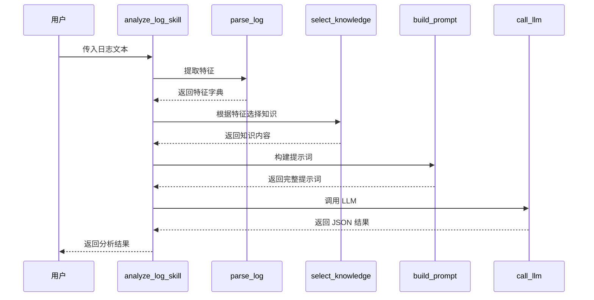

# QNN 日志分析技能

> 基于 LLM 的智能化 Qualcomm QNN SDK 运行时日志分析工具

## 📋 项目概述

QNN 日志分析技能是一个智能化的日志分析系统，专门用于诊断 Qualcomm QNN (Qualcomm Neural Network) SDK 运行时错误。通过结合大语言模型 (LLM) 和结构化知识库，系统能够自动识别错误的根本原因并提供可操作的解决方案，大幅减少人工分析日志的时间成本。

### 核心价值

- **自动化诊断**：无需人工逐行分析日志，系统自动提取关键特征并定位问题
- **智能化分析**：利用 GPT-4o-mini 的语义理解能力，准确识别复杂的错误场景
- **结构化输出**：返回根本原因、解决方案列表和置信度，便于快速决策
- **知识驱动**：基于可扩展的知识库，支持持续积累和沉淀诊断经验

### 适用场景

- 在高通 SoC（如骁龙系列）上部署神经网络模型时的故障排查
- QNN SDK 运行时错误（设备初始化、图创建、推理执行）的快速诊断
- 支持 CPU、GPU、HTP (Hexagon Tensor Processor) 等多种后端类型
- CI/CD 流程中的自动化日志分析和质量检测

## ✨ 功能特性

| 功能模块 | 功能描述 | 技术实现 |
|---------|---------|---------|
| 🔍 日志特征提取 | 自动识别日志中的后端类型和错误模式 | 基于关键字匹配的轻量级解析器 |
| 📚 智能知识库选择 | 根据日志特征动态加载相关知识文档 | 条件判断逻辑，按需加载 overview、errors、sop |
| 📝 结构化提示词构建 | 将日志和知识整合为高质量的 LLM 输入 | 模板化设计，包含规则约束和输出格式要求 |
| 🤖 LLM 智能分析 | 调用大语言模型进行根因分析 | OpenAI GPT-4o-mini，低温度参数确保稳定性 |
| 📊 结构化结果输出 | 返回根本原因、解决方案和置信度 | JSON 格式，包含防御式解析机制 |

### 分析流程


## 📂 项目结构

```
qnn_log_analysis_skill_full/
├── skill.py                 # 主控制器，协调整个分析流程
├── prompt.py                # 提示词构建器，整合知识和日志
├── example.py               # 示例代码，展示三种典型错误场景
└── knowledge/               # 知识库目录
    ├── overview.md          # QNN SDK 基础知识
    ├── errors.md            # 错误知识库（按错误码和阶段分类）
    └── sop.md               # 标准操作程序（五步诊断法）
```

### 文件职责说明

| 文件名 | 职责 | 关键接口 |
|--------|------|---------|
| [skill.py](skill.py) | 主控制器，协调整个分析流程 | `analyze_log_skill(log_text)` |
| [prompt.py](prompt.py) | 提示词构建器，整合知识和日志 | `build_prompt(log_text, knowledge)` |
| [example.py](example.py) | 示例代码，展示三种典型错误场景 | 包含设备创建、图创建、推理执行失败案例 |
| [knowledge/overview.md](knowledge/overview.md) | QNN SDK 基础知识 | 介绍后端类型和典型运行流程 |
| [knowledge/errors.md](knowledge/errors.md) | 错误知识库 | 按错误码和阶段分类的诊断方案 |
| [knowledge/sop.md](knowledge/sop.md) | 标准操作程序 | 五步诊断法指引 |

### 组件交互关系



## 🚀 快速开始

### 前置要求

| 依赖项 | 版本要求 | 说明 |
|--------|---------|------|
| Python | 3.7+ | 推荐 3.8 或更高版本 |
| openai | 最新稳定版 | 用于调用 OpenAI API |
| OpenAI API Key | - | 需要有效的 API 密钥 |

### 安装步骤

1. **克隆或下载项目代码**

```bash
# 下载项目到本地
cd qnn_log_analysis_skill_full
```

2. **安装依赖包**

```bash
pip install openai
```

3. **配置 API 密钥**

编辑 `skill.py` 文件，在第 6 行设置你的 OpenAI API Key：

```python
client = OpenAI(api_key="sk-your-api-key-here")
```

### 快速运行

在项目根目录下执行示例代码：

```bash
python example.py
```

**预期输出**：

系统将分析三个典型的 QNN 日志案例，每个案例都会输出类似以下格式的结果：

```json
{
  "root_cause": "HTP firmware memory fragmentation or insufficient system heap for HTP device creation",
  "solutions": [
    "Ensure proper cleanup of previous QNN contexts",
    "Reboot device to clear HTP memory fragmentation",
    "Check system memory pressure before initializing QNN",
    "Validate HTP firmware and driver compatibility"
  ],
  "confidence": 1.0
}
```

## 📖 使用指南

### 基本用法

```python
from skill import analyze_log_skill

# 准备日志文本
log_text = """
I qnn-net-run: Initializing QNN runtime
I qnn-net-run: Using backend: HTP
E QNN_HTP: qnn_htp_device_create failed
E QNN_HTP: Error code: QNN_STATUS_MEMORY_ALLOCATION_FAILED
E qnn-net-run: QNN inference failed
"""

# 调用分析函数
result = analyze_log_skill(log_text)

# 使用分析结果
print(f"根本原因: {result['root_cause']}")
print(f"解决方案: {result['solutions']}")
print(f"置信度: {result['confidence']}")
```

### 输入格式说明

| 参数 | 类型 | 说明 | 示例 |
|------|------|------|------|
| log_text | 字符串 | QNN 运行时日志内容 | 包含 ERROR、INFO 等级别的完整日志 |

### 输出格式说明

| 字段 | 类型 | 说明 |
|------|------|------|
| root_cause | 字符串 | 错误的根本原因分析 |
| solutions | 字符串数组 | 按优先级排序的解决方案列表 |
| confidence | 浮点数 | 分析结果的置信度（0.0-1.0） |

### 典型应用场景

#### 场景一：设备初始化失败

**日志特征**：
```
E QNN_HTP: qnn_htp_device_create failed
E QNN_HTP: Error code: QNN_STATUS_MEMORY_ALLOCATION_FAILED
```

**分析结果**：
- 根本原因：HTP 固件内存碎片化或系统堆不足
- 建议方案：
  - 确保清理旧的 QNN 上下文
  - 重启设备清除 HTP 内存碎片
  - 检查系统内存压力
  - 验证 HTP 固件和驱动兼容性

#### 场景二：图创建失败

**日志特征**：
```
E QNN_HTP: qnn_graph_create failed
E QNN_HTP: Error code: QNN_STATUS_MEMORY_ALLOCATION_FAILED
```

**分析结果**：
- 根本原因：图张量数量超过 HTP 容量
- 建议方案：
  - 启用图分割以拆分大型图
  - 降低输入分辨率或批量大小
  - 应用算子融合或剪枝
  - 验证 HTP 支持图中所有算子

#### 场景三：推理执行失败

**日志特征**：
```
E QNN_HTP: qnn_execute_graph failed
E QNN_HTP: Error code: QNN_STATUS_MEMORY_ALLOCATION_FAILED
```

**分析结果**：
- 根本原因：运行时激活缓冲区超过 HTP 内存
- 建议方案：
  - 固定输入形状，避免动态维度
  - 减少并发 QNN 会话数量
  - 使用低精度（INT8）减少激活内存
  - 序列化推理执行避免内存竞争

## 🏗️ 技术架构

### 架构设计理念

- **分层架构**：将接口层、业务逻辑层、提示词层、知识库层清晰分离
- **模块化设计**：每个模块职责单一，易于测试和维护
- **知识驱动**：通过外部知识文件驱动诊断逻辑，便于扩展
- **LLM 集成**：利用大语言模型的语义理解能力进行智能分析

### 核心组件

| 组件名称 | 设计模式 | 核心职责 |
|---------|---------|---------|
| analyze_log_skill | 门面模式 | 统一对外接口，协调各组件 |
| parse_log | 策略模式 | 可扩展的特征提取策略 |
| select_knowledge | 工厂模式 | 根据特征动态选择知识 |
| build_prompt | 建造者模式 | 构建结构化提示词 |
| call_llm | 适配器模式 | 封装 OpenAI API 调用 |

### 数据流转



### 技术决策

| 决策点 | 选择方案 | 理由 |
|--------|---------|------|
| LLM 模型 | GPT-4o-mini | 成本低、响应快、准确度满足需求 |
| 温度参数 | 0.1 | 日志分析需要确定性强的结果 |
| 知识存储 | Markdown 文件 | 易于编辑维护，便于版本控制 |
| 特征提取 | 关键字匹配 | 轻量级，无需复杂的正则表达式 |
| JSON 解析 | 防御式解析 | 防止 LLM 输出格式异常导致系统崩溃 |

## 📚 知识库说明

### 知识库结构

#### overview.md - 基础知识
- **内容范围**：QNN SDK 简介、后端类型（CPU/GPU/HTP）、典型运行流程
- **维护原则**：保持简洁，聚焦运行时背景
- **更新频率**：随 QNN SDK 大版本更新

#### errors.md - 错误知识库
- **组织方式**：按错误码分节，每个错误码按阶段（设备初始化、图创建、推理执行）细分
- **条目结构**：典型日志 + 根本原因 + 解决方案
- **维护原则**：确保错误码命名一致、阶段描述准确、方案可操作
- **扩展方式**：遇到新错误类型时添加新章节

#### sop.md - 标准操作程序
- **内容**：五步诊断法流程
- **步骤**：识别后端 → 提取错误码 → 定位阶段 → 应用方案 → 记录新案例
- **维护原则**：保持流程清晰可执行

### 知识库扩展指南

添加新错误类型的步骤：

1. 收集典型日志样本
2. 分析根本原因
3. 验证解决方案有效性
4. 在 `errors.md` 中添加新章节
5. 更新 `parse_log` 函数以识别新特征（如需要）
6. 测试分析准确性

### 知识库质量标准

| 质量维度 | 评估标准 |
|---------|---------|
| 准确性 | 根因分析基于官方文档或实测验证 |
| 完整性 | 覆盖常见的 QNN 运行时错误场景 |
| 可操作性 | 解决方案具体明确，可直接执行 |
| 一致性 | 术语、格式、结构保持统一 |
| 时效性 | 与当前 QNN SDK 版本保持同步 |

## ⚙️ 配置说明

### 必需配置项

| 配置项 | 位置 | 说明 | 示例 |
|--------|------|------|------|
| OpenAI API Key | skill.py 第 6 行 | 用于调用 OpenAI 服务 | `sk-xxxxxxxxxxxxxxxx` |

### 可选配置项

| 配置项 | 位置 | 默认值 | 说明 |
|--------|------|--------|------|
| LLM 模型 | skill.py `call_llm` 函数 | `gpt-4o-mini` | 可更换为其他 OpenAI 模型 |
| 温度参数 | skill.py `call_llm` 函数 | `0.1` | 控制输出随机性，建议保持低值 |
| 知识库路径 | skill.py `select_knowledge` 函数 | `knowledge/` | 可指定自定义知识库位置 |
| 系统提示词 | skill.py `SYSTEM_PROMPT` | 预定义规则 | 可根据需求调整约束规则 |

### 配置建议

针对不同使用场景的配置推荐：

- **生产环境**：保持默认配置，确保稳定性
- **开发测试**：可提高温度参数观察多样性
- **离线环境**：需替换为本地 LLM 服务
- **定制场景**：扩展知识库并调整特征提取逻辑

## ❓ 常见问题

### 安装和配置类问题

**Q: ModuleNotFoundError: No module named 'openai'**
- **原因**：未安装 openai 依赖包
- **解决方法**：执行 `pip install openai` 安装

**Q: API 调用失败，提示认证错误**
- **原因**：API Key 未配置或无效
- **解决方法**：检查 `skill.py` 中的 API Key 配置是否正确

**Q: 知识库文件读取失败**
- **原因**：运行目录不正确或文件路径错误
- **解决方法**：确保在项目根目录运行，检查 `knowledge/` 目录是否存在

### 使用类问题

**Q: 分析结果置信度很低**
- **原因**：日志信息不完整或错误类型不在知识库中
- **解决方法**：补充完整日志，或扩展知识库添加新错误类型

**Q: 返回的是 raw_output 而不是结构化结果**
- **原因**：LLM 输出格式不符合 JSON 规范
- **解决方法**：检查系统提示词约束，或调整温度参数

**Q: 分析速度较慢**
- **原因**：网络延迟或 API 响应时间
- **解决方法**：考虑使用缓存机制或本地 LLM 部署

### 扩展类问题

**Q: 如何支持新的错误码？**
- **解决方法**：在 `errors.md` 中添加新条目，更新特征提取逻辑

**Q: 如何更换为其他 LLM 服务？**
- **解决方法**：修改 `call_llm` 函数，适配新的 API 接口

**Q: 如何添加日志预处理逻辑？**
- **解决方法**：在 `parse_log` 函数中扩展特征提取规则

## 💡 最佳实践

### 日志准备建议

- **完整性**：提供从初始化到失败的完整日志链
- **上下文**：包含足够的 INFO 级别日志辅助定位
- **格式**：保持原始日志格式，不要过度裁剪
- **敏感信息**：移除涉及隐私的路径或配置信息

### 知识库维护建议

- **定期更新**：跟随 QNN SDK 版本更新知识内容
- **案例积累**：将实际遇到的新错误及时补充
- **质量审查**：定期验证解决方案的有效性
- **版本管理**：使用 Git 跟踪知识库变更历史

### 性能优化建议

| 优化方向 | 实现方式 | 预期收益 |
|---------|---------|---------|
| 减少 API 调用 | 实现结果缓存机制 | 降低成本和延迟 |
| 知识库预加载 | 启动时加载到内存 | 减少文件 I/O |
| 批量分析 | 支持多日志并发处理 | 提高吞吐量 |
| 本地模型 | 部署私有 LLM 服务 | 提升响应速度和数据安全 |

### 集成建议

- **CI/CD 集成**：作为自动化测试流程的一部分
- **监控系统集成**：实时分析生产环境日志
- **告警系统集成**：根据分析结果自动触发告警
- **知识管理系统集成**：将诊断结果沉淀为知识库

## 🤝 贡献指南

### 如何贡献

我们欢迎以下类型的贡献：

- 补充新的错误案例和解决方案
- 改进代码质量和性能
- 完善文档和注释
- 报告 Bug 和提出改进建议

### 贡献流程

1. Fork 项目仓库
2. 创建特性分支
3. 提交代码或文档变更
4. 确保变更符合项目规范
5. 提交 Pull Request 并描述变更内容

### 代码规范

- Python 代码遵循 PEP 8 风格指南
- 函数添加清晰的文档字符串
- 关键逻辑添加注释说明
- 提交信息使用清晰的描述

### 知识库贡献规范

- 新增错误条目遵循现有模板结构
- 提供真实可复现的日志样本
- 解决方案需经过实际验证
- 保持术语和格式一致性

## 📄 许可证

本项目采用 MIT 许可证。详情请参阅 LICENSE 文件。

## 📧 联系方式

如有问题或建议，欢迎通过以下方式联系：

- 提交 Issue：[GitHub Issues](https://github.com/your-repo/issues)
- 技术交流：欢迎加入技术讨论群组

## 🙏 致谢

感谢以下开源项目和工具的支持：

- [OpenAI](https://openai.com/) - 提供强大的 GPT 系列模型
- [Qualcomm QNN SDK](https://www.qualcomm.com/) - 高通神经网络 SDK
- 所有为本项目做出贡献的开发者

---

**注意**：本工具旨在辅助诊断 QNN 运行时错误，建议结合官方文档和实际测试验证解决方案的有效性。
